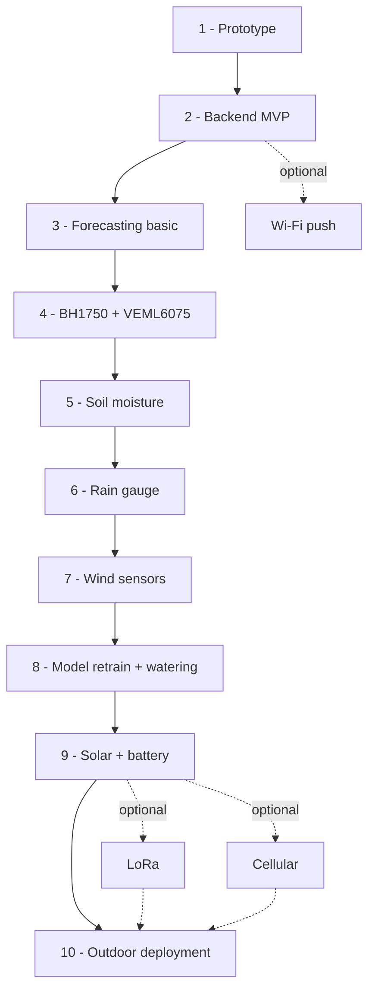

# PAWS — Personal Autonomous Weather Station 

> Low-powered ESP32 IoT weather station — SD card logging, RTC timekeeping, phone-based data gateway, time-series database, online dashboard and weather forecasting.

A learning-oriented IoT project covering the full stack: embedded firmware, solar power, asynchronous data pipeline, and machine learning on local sensor data. Sensor set covers standard meteorology plus soil moisture and rainfall — targeting small-scale precision agriculture use cases.

> 🌻 *Yes, that's a sunflower. It watches the sun. This station watches the weather. Close enough.*

## Documentation

Full design documentation (architecture, hardware, firmware, backend, ML): [personal-autonomous-weather-station](https://wg1d.github.io/personal-autonomous-weather-station/)

## Roadmap

| Phase | Name | Key addition | Status |
|-------|------|-------------|--------|
| 1 | Prototype | Core FSM + SD logging | 🟡 In progress |
| 2 | Backend MVP | Odroid C4 + gateway + dashboard | ⬜ Planned |
| 3 | Forecasting — basic | LSTM on temp/pressure/humidity | ⬜ Planned |
| 4 | Sensors: BH1750 + VEML6075 | Light + UV, I²C/STEMMA QT | ⬜ Planned |
| 5 | Sensor: Soil moisture | Capacitive probe, ADC, calibration | ⬜ Planned |
| 6 | Sensor: Rain gauge | Tipping bucket, interrupt, pulse counting | ⬜ Planned |
| 7 | Sensor: Wind | Anemometer + wind vane | ⬜ Planned |
| 8 | Model retrain + watering | Expanded LSTM + Random Forest watering model | ⬜ Planned |
| 9 | Power: Solar + battery | MPPT + LiFePO₄, battery monitoring | ⬜ Planned |
| 10 | Stevenson screen + outdoor deployment | Final assembly into enclosure / Stevenson screen | ⬜ Planned |
| ◇ Optional | Wi-Fi push | Direct upload after each wake, no gateway | ⬜ Planned |
| ◇ Optional | LoRa | Low-power long-range for field/allotment deployments | ⬜ Planned |
| ◇ Optional | Cellular | GSM/LTE for remote deployments with no LoRa coverage | ⬜ Planned |

See [ROADMAP.md](ROADMAP.md) for detailed per-phase deliverables, hardware lists, and exit criteria.

## Related projects

- [3D-PAWS](https://3dpaws.comet.ucar.edu/) (UCAR/COMET) — *3D-Printed Automatic Weather Station*: open-source low-cost weather station with 3D-printed sensor housings.

## License

MIT — see [LICENSE](LICENSE)
