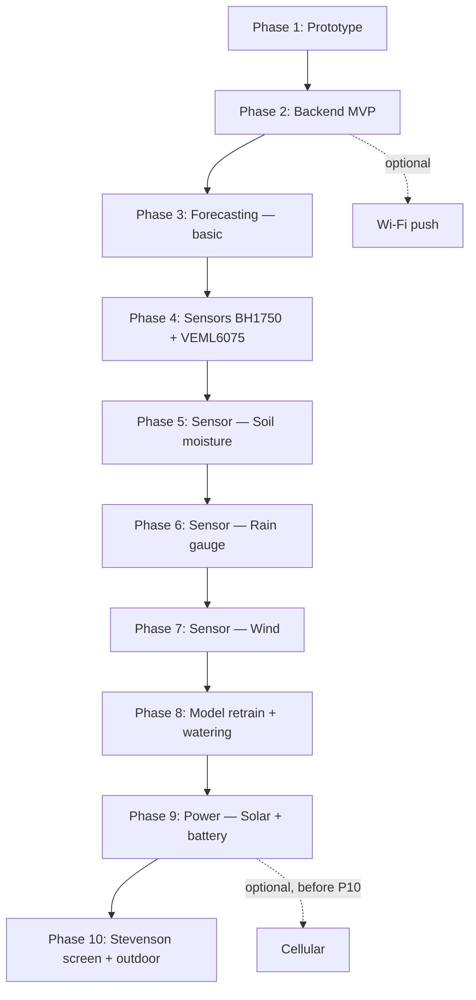

# ROADMAP

> Each phase must be **independently useful**. You should be able to stop at any phase and have a working, valuable system.
>
> Hardware and software investments made in one phase are never thrown away. The architecture (FSM, data format, connector interfaces) is frozen from Phase 1. Only capabilities are added.

---

## Phase overview

| Phase | Name | Key addition | Exit criterion |
|-------|------|-------------|----------------|
| 1 | Prototype | Core FSM + SD logging | 48h stable data on SD |
| 2 | Backend MVP | Odroid C4 + gateway + dashboard | Data flows prototype → dashboard |
| 3 | Forecasting — basic | LSTM on temp/pressure/humidity | Forecast beats baseline |
| 4 | Sensors: BH1750 + VEML6075 | Light + UV over I²C/STEMMA QT | Light + UV validated |
| 5 | Sensor: Soil moisture | Capacitive probe + ADC + calibration | Soil readings calibrated |
| 6 | Sensor: Rain gauge | Tipping bucket + interrupt pulse counting | Rain pulses calibrated |
| 7 | Sensor: Wind | Anemometer + wind vane | Wind speed + direction validated |
| 8 | Model retrain + watering | Full-feature LSTM + RF watering model | Models improved and deployed |
| 9 | Power: Solar + battery | MPPT + LiFePO₄ + battery monitoring | 24h autonomous bench run |
| 10 | Stevenson screen + outdoor deployment | Final assembly + outdoor installation | 2 weeks outdoor stable data |
| ◇ Optional | Wi-Fi push | Direct upload after each wake, no gateway | Direct push works on home Wi-Fi |
| ◇ Optional | Cellular | GSM/LTE for remote deployments | Remote upload works without Wi-Fi |

## Dependency graph

The main track is fully linear: Phase 1 → Phase 2 → ... → Phase 10. This is deliberate. Hardware is validated on breadboard first, software grows around the validated hardware, and the clean assembly only happens once the full system is known.

Breadboard-first stays the governing rule throughout: sensors, solar, and optional cellular are all proven before the enclosure is designed around them. There is no custom PCB phase. The final clean build happens once, inside the Stevenson screen deployment phase, using plug-and-play modules, STEMMA QT / Qwiic for I²C, and JST connectors for field sensors.

Optional connectivity also follows this structure. Wi-Fi push can be added any time after Phase 2 because the ESP32 already has Wi-Fi hardware. Cellular is optional too, but it must be validated before Phase 10 so its module, antenna, and power behavior are accounted for in the final enclosure.

---

## Phase 1 — Prototype

**Goal:** Validate the core architecture.

### Hardware
- Upesy ESP32 WROVER DevKit
- DS3231 RTC module
- BME280 sensor
- SD card module
- Breadboard + Dupont wires

### Software deliverables
- [ ] FSM with 3 states: `DATA_LOGGER`, `SERVER`, `INIT_RTC`
- [ ] Deep sleep + EXT0 wake on DS3231 INT
- [ ] Rolling alarm scheduling
- [ ] SD append-only CSV logging (full schema with placeholder columns for all planned sensors)
- [ ] `SERVER` mode Wi-Fi AP + minimal web UI (file list + download)
- [ ] `INIT_RTC` via NTP

### Key decisions frozen in this phase
- CSV column schema (include placeholder columns for all future sensors)
- GPIO pin assignments
- Measurement interval (default: 10 minutes)
- Filesystem layout on SD

### Exit criterion
48 continuous hours of measurements with correct timestamps, no SD errors, correct deep sleep current (~10–15 µA).

---

## Phase 2 — Backend MVP

**Goal:** Validate the full data pipeline early using prototype hardware.

> Do this before adding more hardware. Validating ingestion, storage, API shape, and dashboarding on the Phase 1 prototype de-risks every later phase.

### Hardware
- Odroid C4
- Ethernet connection

### Software deliverables

**Gateway (phone or laptop script):**
- [ ] Python script: connect to station AP → download CSV → upload to server
- [ ] Deduplication on upload (skip already-ingested timestamps)

> The gateway is the baseline data path. It stays as a fallback even if direct push is added later, which makes it still useful for field deployments or for recovery when Wi-Fi is unavailable.

**Server (Odroid C4):**
- [ ] FastAPI REST API: `POST /api/upload`, `GET /api/data`, `GET /api/latest`
- [ ] InfluxDB v1 — write measurements via line protocol, query via InfluxQL
- [ ] Grafana installation + InfluxDB data source
- [ ] Dashboard: current conditions, temperature / pressure / humidity history

**Operational:**
- [ ] Server starts on Odroid boot (`systemd` service)
- [ ] API accessible on local network at `http://odroid.local:8000`

### Exit criterion
Data flows from SD card to Grafana in <1 hour after gateway run. Dashboard shows at least 7 days of history.

---

## Phase 3 — Forecasting — basic

**Goal:** Deploy a first working weather forecast model using only the sensors already available from Phase 1. Establish the ML pipeline before the sensor set grows.

The LSTM is trained on 2–3 years of hourly OpenMeteo historical data for the station's location, using only temperature, pressure, and humidity — the three features already available from the prototype. Local station data can supplement training once enough has been collected.

This is deliberately a constrained model. Pressure trend alone is highly predictive for short-term forecasting, so the first model should prove it can beat that baseline before the project adds more complexity. The model will be retrained with the full feature set in Phase 8.

### Software deliverables
- [ ] Download 2–3 years of OpenMeteo hourly data (temperature, pressure, humidity)
- [ ] Train LSTM with 24h input → `t+1h`, `t+3h`, `t+6h` output
- [ ] Compare against pressure-trend baseline
- [ ] Export model to ONNX or TFLite and deploy on Odroid C4
- [ ] FastAPI endpoint `GET /api/predict/forecast`
- [ ] Grafana panel: 6h forecast overlay on current conditions

### Exit criterion
LSTM outperforms the pressure-trend baseline on the 3h horizon. Forecast is visible in the dashboard.

---

## Phase 4 — Sensors: BH1750 + VEML6075

**Goal:** Add light and UV index to the measurement set.

Both are simple I²C sensors that chain directly onto the existing STEMMA QT bus — low friction, high value, no enclosure redesign needed yet.

### Hardware
- BH1750 light sensor (lux)
- VEML6075 UV sensor (UVA / UVB index)
- STEMMA QT / Qwiic cable

### Software deliverables
- [ ] BH1750 driver integration
- [ ] VEML6075 driver integration
- [ ] CSV columns `light_lux` and `uv_idx` now populated
- [ ] Backend ingestion and Grafana updated for both new fields

### Exit criterion
Both sensors read correctly on breadboard. Data appears in Grafana dashboard.

---

## Phase 5 — Sensor: Soil moisture

**Goal:** Add soil moisture monitoring.

This is the first true field sensor in the roadmap, and it introduces calibration work rather than only digital integration.

### Hardware
- Capacitive soil moisture probe (3.3V-compatible)

### Software deliverables
- [ ] ADC reading + percentage conversion
- [ ] Dry / wet calibration procedure
- [ ] CSV column `soil_pct` now populated
- [ ] Backend ingestion and Grafana updated for soil moisture

### Exit criterion
Readings respond correctly to dry / wet test conditions. Calibration procedure is documented and repeatable.

---

## Phase 6 — Sensor: Rain gauge

**Goal:** Add rainfall measurement.

This is the first interrupt-driven sensor and the first one that depends on robust pulse counting rather than simple polling.

### Hardware
- Tipping bucket rain gauge (reed switch or Hall effect)

### Software deliverables
- [ ] Interrupt handler + pulse counting during sleep (using RTC or GPIO wakeup strategy as needed)
- [ ] `mm/tip` calibration factor
- [ ] CSV column `rain_mm` now populated
- [ ] Backend ingestion and Grafana updated for rainfall

### Exit criterion
Pulse counting validated against a known water volume. Calibration factor derived and recorded.

---

## Phase 7 — Sensor: Wind

**Goal:** Add wind speed and direction.

This completes the core meteorological sensor set before model retraining and before the final enclosure is designed.

### Hardware
- Cup anemometer (pulse output)
- Wind vane (resistive ADC)

### Software deliverables
- [ ] Anemometer pulse counting + m/s conversion
- [ ] Wind vane ADC → direction lookup table → degrees
- [ ] CSV columns `wind_spd_ms` and `wind_dir_deg` now populated
- [ ] Backend ingestion and Grafana updated for wind

### Exit criterion
Both sensors read correctly on breadboard. Direction table validated at 8 positions.

---

## Phase 8 — Model retrain + watering

**Goal:** Retrain the weather forecast model with the full sensor set and deploy the plant watering recommendation model.

All sensor features are now known and validated. That makes this the right point to expand the ML pipeline from the constrained Phase 3 forecast into a full multi-sensor system.

Model architecture and training pipeline are developed here, but actual fine-tuning on rich real-world local data requires the deployed station from Phase 10. In practice, the models can be pre-trained on OpenMeteo plus synthetic or weakly labeled data now, then refined later once outdoor data accumulates.

### Software deliverables

**Expanded LSTM:**
- [ ] Feature engineering with rolling windows (24h, 48h, 72h) across all sensors
- [ ] Retrain LSTM with full feature set: temperature, pressure, humidity, light, UV, soil, rain, wind
- [ ] Compare against Phase 3 baseline and quantify improvement
- [ ] Update FastAPI forecast endpoint
- [ ] Update Grafana forecast panel

**Watering model (Random Forest):**
- [ ] Build labeled dataset (manual + threshold-based labeling)
- [ ] Train `RandomForestClassifier` with cross-validation
- [ ] Export model with `joblib`
- [ ] FastAPI endpoint `GET /api/predict/watering`
- [ ] Grafana panel: watering recommendation (Yes / No + confidence)

### Exit criterion
Expanded LSTM improves on the Phase 3 baseline. Watering model reaches F1 > 0.75 on validation set.

---

## Phase 9 — Power: Solar + battery

**Goal:** Validate the solar power system on the bench before committing to the final enclosure.

This phase proves the power budget, charge controller behavior, and battery monitoring while the system is still easy to modify. Breadboard-first still applies here: solar is validated before enclosure design is frozen.

### Hardware
- Solar panel (5–10W)
- MPPT charge controller (CN3791-based or similar)
- LiFePO₄ battery (2000–4000 mAh)
- Voltage divider for ADC battery monitoring

### Software deliverables
- [ ] Battery voltage ADC reading → CSV column `bat_v`
- [ ] Low battery alert: reduce measurement interval if voltage drops below threshold
- [ ] Grafana panel: battery level

### Exit criterion
System runs autonomously on solar for 24h on the bench. Battery voltage stays above minimum threshold.

---

## Phase 10 — Stevenson screen + outdoor deployment

**Goal:** Assemble all validated hardware into its final form and deploy outdoors.

This is the only phase where the enclosure is assembled cleanly. There is no separate "clean board" phase anymore because the clean assembly *is* the outdoor assembly. The enclosure is designed once the complete hardware set is known from Phases 4–9.

No custom PCB is required. The final system stays modular: STEMMA QT chain for I²C sensors, JST connectors for field sensors, off-the-shelf boards throughout, mounted cleanly inside an IP65 enclosure housed in a Stevenson screen.

### Hardware
- IP65 enclosure sized for all hardware validated in Phases 4–9
- Stevenson screen
  - Double-louvered
  - Painted white
  - Mounted 1.25–1.5 m above ground
- Cable glands for power, soil moisture, rain gauge, anemometer / vane, solar
- JST-PH connectors for all field sensors
- STEMMA QT chain for I²C sensors
- All sensors from Phases 4–7 installed in final positions
- Solar system from Phase 9 connected

### Deliverables
- [ ] Clean wiring inside enclosure
- [ ] All sensors installed in final positions (soil probe in ground, rain gauge leveled, anemometer on mast)
- [ ] System boots, logs, and data appears in Grafana

### Exit criterion
2 continuous weeks of outdoor data with no SD errors, no moisture ingress, all sensors reporting.

---

## Optional — Wi-Fi push (after Phase 2)

**Goal:** Eliminate the phone-based gateway for home deployments.

The ESP32 already has Wi-Fi hardware, so this is a pure firmware feature and can be implemented any time after Phase 2. The station connects directly to home Wi-Fi after each wake and POSTs the latest measurement to the backend.

The gateway script from Phase 2 is not removed — it remains a valid fallback for field deployments or when Wi-Fi is unavailable. SD logging also remains in place as a local buffer.

### Firmware deliverables
- [ ] New FSM state `PUSH`: connect to home Wi-Fi, POST latest row to `POST /api/upload`, disconnect
- [ ] Config: `WIFI_SSID`, `WIFI_PASSWORD`, `SERVER_URL` in `config.h` or NVS
- [ ] Retry logic: if push fails, mark row as pending and retry on next wake
- [ ] AP / `SERVER` mode kept for manual fallback
- [ ] Power budget validation: Wi-Fi connect + POST + disconnect stays within acceptable duty cycle

### Exit criterion
Dashboard updates within 1 minute of each wake. No manual gateway run needed for in-range deployments.

---

## Optional — Cellular (validate before Phase 10)

**Goal:** Enable deployments with no Wi-Fi — remote garden, allotment, field site.

This is optional hardware plus firmware. It is not required for home deployments, but if it is used, it must be validated on the bench before Phase 10 so the module, antenna, power draw, and enclosure fit are all known in advance.

### Hardware
- GSM / LTE module (`SIM7600` via UART, or `SIM800L` for 2G-only sites)
- SIM card (data-only)
- Antenna

### Firmware deliverables
- [ ] UART driver for GSM module
- [ ] Reuse `PUSH` state logic — swap Wi-Fi transport for GSM HTTP POST
- [ ] Power management: modem powered down between wakes via MOSFET
- [ ] CSV column `rssi` for signal strength logging

### Exit criterion
Data uploads from a location with no Wi-Fi. Dashboard updates within 5 minutes of each wake.
