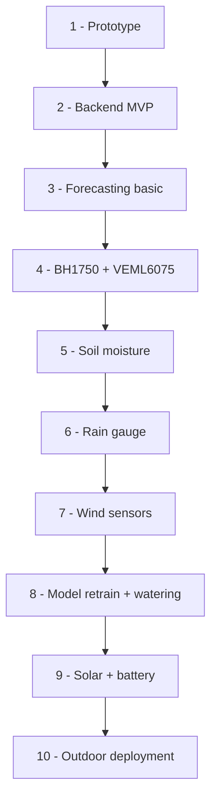

# ROADMAP

> Each phase must be **independently useful**. You should be able to stop at any phase and have a working, valuable system.
>
> Hardware and software investments made in one phase are never thrown away. The architecture (FSM, data format, connector interfaces) is frozen from Phase 1. Only capabilities are added.

---

## Phase overview

| Phase | Name | Key addition | Exit criterion |
|-------|------|-------------|----------------|
| 1 | Prototype | Core FSM + SD logging | 48h stable data on SD |
| 2 | Backend MVP | SBC + automated Wi-Fi push + gateway fallback | Data flows directly or via gateway to dashboard |
| 3 | Forecasting — basic | LSTM on temp/pressure/humidity | Forecast beats baseline |
| 4 | Sensors: BH1750 + VEML6075 | Light + UV over I²C/STEMMA QT | Light + UV validated |
| 5 | Sensor: Soil moisture | Capacitive probe + ADC + calibration | Soil readings calibrated |
| 6 | Sensor: Rain gauge | Tipping bucket + interrupt pulse counting | Rain pulses calibrated |
| 7 | Sensor: Wind | Anemometer + wind vane | Wind speed + direction validated |
| 8 | Model retrain + watering | Full-feature LSTM + RF watering model | Models improved and deployed |
| 9 | Power: Solar + battery | MPPT + LiFePO₄ + battery monitoring | 24h autonomous bench run |
| 10 | Stevenson screen + outdoor deployment | Final assembly + outdoor installation | 2 weeks outdoor stable data |

## Dependency graph

```mermaid
flowchart TD
    P1[1 - Prototype] --> P2[2 - Backend MVP]
    P2 --> P3[3 - Forecasting basic]
    P3 --> P4[4 - BH1750 + VEML6075]
    P4 --> P5[5 - Soil moisture]
    P5 --> P6[6 - Rain gauge]
    P6 --> P7[7 - Wind sensors]
    P7 --> P8[8 - Model retrain + watering]
    P8 --> P9[9 - Solar + battery]
    P9 --> P10[10 - Outdoor deployment]
```

The main track is fully linear: Phase 1 → Phase 2 → ... → Phase 10. This is deliberate. Hardware is validated on breadboard first, software grows around the validated hardware, and the clean assembly only happens once the full system is known.

Breadboard-first stays the governing rule throughout: sensors, solar, and charge controller are all proven before the enclosure is designed around them. There is no custom PCB phase. The final clean build happens once, inside the Stevenson screen deployment phase, using plug-and-play modules, STEMMA QT / Qwiic for I²C, and JST connectors for field sensors.

---

## Phase 1 — Prototype

**Goal:** Validate the core architecture.

### Hardware Pin Mapping (from Breadboard)
- **ESP32 DevKit** (e.g. Upesy WROVER DevKit)
- **BME280 Sensor (I²C):** SDA = GPIO 21, SCL = GPIO 22
- **DS3231 RTC Module (I²C):** SQW/INT = GPIO 36 (wakes ESP32 via `EXT0` wakeup)
- **Manual Button:** GPIO 39 with external pull-up resistor (wakes ESP32 via `EXT1` wakeup)
- **SD Card Reader Module (SPI):** CS = GPIO 5, SCK = GPIO 18, MISO = GPIO 19, MOSI = GPIO 23
- **SD Card Power Control Pin:** GPIO 13 (acts as a power gate to disable SD reader during deep sleep)
- **MicroSD Card:** 32GB or less, formatted to FAT32
- **Linux computer:** acting as the test server

### Incremental Software Steps
- [ ] **Step 1.1: ESP32 Deep Sleep & Wakeup Causes**
  - Implement deep sleep entry and track wakeup causes.
  - Configure manual button wakeup on GPIO 39 via `EXT1`.
  - Preserve boot count and state during sleep using `RTC_DATA_ATTR`.
- [ ] **Step 1.2: External RTC (DS3231) & NTP Time Sync**
  - Connect DS3231 RTC over I²C.
  - Set the RTC from an online NTP server via a temporary Wi-Fi connection.
  - Configure DS3231 periodic interrupts (every 1 minute, 10 minutes, or daily) to wake the ESP32 via `EXT0` wakeup on GPIO 36.
- [ ] **Step 1.3: Sensor Reading (Temperature, Humidity, Pressure)**
  - Read environmental conditions from the BME280 sensor over I²C (address `0x76` or `0x77`).
  - Handle communication errors or missing readings.
- [ ] **Step 1.4: SD Card CSV Logger**
  - Interface with the SD card reader over SPI using default VSPI pins.
  - Implement power gating via GPIO 13 (power on before read/write, power off before sleep).
  - Open/create log files and append timestamped, schema-compliant rows (with placeholder columns for future sensors).
- [ ] **Step 1.5: Wi-Fi Hotspot & Local Web Server (SERVER Mode)**
  - Wake up via `EXT1` trigger (button press / Ground connection on GPIO 39).
  - Spin up the ESP32 in Access Point (AP) mode.
  - Launch a lightweight web server serving a basic HTML page listing the logged CSV files and offering downloads.
- [ ] **Step 1.6: Direct Wi-Fi Connection & Linux Server Integration**
  - Connect the ESP32 as a Wi-Fi client to the local network.
  - Perform HTTP POST requests to upload CSV data to a server.
  - Implement a simple Python HTTP receiver script to run on the Linux host machine.

### Key decisions frozen in this phase
- CSV column schema (include placeholder columns for all future sensors)
- GPIO pin assignments (frozen to match breadboard)
- Measurement interval (default: 10 minutes, wake-on-alarm)
- Filesystem layout on SD

### Exit criterion
48 continuous hours of measurements with correct timestamps, no SD errors, correct deep sleep current (~10–15 µA) on the breadboard, and successful direct upload/manual download verification.

---

## Phase 2 — Backend MVP

**Goal:** Validate the full data pipeline (automated Wi-Fi push + phone gateway fallback) early using prototype hardware.

> Do this before adding more hardware. Validating ingestion, storage, API shape, and dashboarding on the Phase 1 prototype de-risks every later phase.

### Hardware
- Odroid C4 (existing) or Raspberry Pi (e.g. Pi Zero 2 W as a cheap, robust alternative)
- Connected to home network via Ethernet

### Software deliverables

**Firmware (Automated Wi-Fi Push):**
- [ ] New FSM state/transition: if home Wi-Fi is in range after taking measurements, connect and POST data to the server API, then sleep.
- [ ] Configuration for home Wi-Fi credentials (SSID/Password) in NVS or config file.
- [ ] Fallback logic: if Wi-Fi connection fails or is not available, proceed to deep sleep directly (data remains buffered on SD card).
- [ ] User triggers AP / SERVER mode manually via button press for local download fallback.

**Gateway (phone or laptop script fallback):**
- [ ] Python script: connect to station AP → download CSV → upload to server
- [ ] Deduplication on upload (skip already-ingested timestamps)

> The manual phone gateway remains a robust fallback when home Wi-Fi is not configured, out of range, or temporarily down.

**Server (Odroid C4 / Raspberry Pi):**
- [ ] FastAPI REST API: `POST /api/upload`, `GET /api/data`, `GET /api/latest`
- [ ] Database: InfluxDB v1 (standard stack) or Tinyflux / SQLite (lightweight Pi Zero stack)
- [ ] Dashboard setup: Grafana (standard) or Plotly Dash / client-side Plotly.js (lightweight)
- [ ] Dashboard: current conditions, temperature / pressure / humidity history

**Operational:**
- [ ] Server starts on SBC boot (systemd service)
- [ ] API accessible on local network (`http://odroid.local:8000` or `http://raspberrypi.local:8000`)

### Exit criterion
Data flows from SD card to Grafana/Plotly dashboard. Dashboard shows at least 7 days of history.

---

## Phase 3 — Forecasting — basic

**Goal:** Deploy a first working weather forecast model using only the sensors already available from Phase 1. Establish the ML pipeline before the sensor set grows.

The LSTM is trained on 2–3 years of hourly OpenMeteo historical data for the station's location, using only temperature, pressure, and humidity — the three features already available from the prototype. Local station data can supplement training once enough has been collected.

This is deliberately a constrained model. Pressure trend alone is highly predictive for short-term forecasting, so the first model should prove it can beat that baseline before the project adds more complexity. The model will be retrained with the full feature set in Phase 8.

### Software deliverables
- [ ] Download 2–3 years of OpenMeteo hourly data (temperature, pressure, humidity)
- [ ] Train LSTM with 24h input → `t+1h`, `t+3h`, `t+6h` output
- [ ] Compare against pressure-trend baseline
- [ ] Export model to ONNX or TFLite and deploy on SBC (Odroid C4 / Raspberry Pi)
- [ ] FastAPI endpoint `GET /api/predict/forecast`
- [ ] Grafana panel: 6h forecast overlay on current conditions

### Exit criterion
LSTM outperforms the pressure-trend baseline on the 3h horizon. Forecast is visible in the dashboard.

---

## Phase 4 — Sensors: BH1750 + VEML6075

**Goal:** Add light and UV index to the measurement set.

Both are simple I²C sensors that chain directly onto the existing STEMMA QT bus — low friction, high value, no enclosure redesign needed yet.

### Hardware
- BH1750 light sensor (lux)
- VEML6075 UV sensor (UVA / UVB index)
- STEMMA QT / Qwiic cable

### Software deliverables
- [ ] BH1750 driver integration
- [ ] VEML6075 driver integration
- [ ] CSV columns `light_lux` and `uv_idx` now populated
- [ ] Backend ingestion and Grafana updated for both new fields

### Exit criterion
Both sensors read correctly on breadboard. Data appears in Grafana dashboard.

---

## Phase 5 — Sensor: Soil moisture

**Goal:** Add soil moisture monitoring.

This is the first true field sensor in the roadmap, and it introduces calibration work rather than only digital integration.

### Hardware
- Capacitive soil moisture probe (3.3V-compatible)

### Software deliverables
- [ ] ADC reading + percentage conversion
- [ ] Dry / wet calibration procedure
- [ ] CSV column `soil_pct` now populated
- [ ] Backend ingestion and Grafana updated for soil moisture

### Exit criterion
Readings respond correctly to dry / wet test conditions. Calibration procedure is documented and repeatable.

---

## Phase 6 — Sensor: Rain gauge

**Goal:** Add rainfall measurement.

This is the first interrupt-driven sensor and the first one that depends on robust pulse counting rather than simple polling.

### Hardware
- Tipping bucket rain gauge (reed switch or Hall effect)

### Software deliverables
- [ ] Interrupt handler + pulse counting during sleep (using RTC or GPIO wakeup strategy as needed)
- [ ] `mm/tip` calibration factor
- [ ] CSV column `rain_mm` now populated
- [ ] Backend ingestion and Grafana updated for rainfall

### Exit criterion
Pulse counting validated against a known water volume. Calibration factor derived and recorded.

---

## Phase 7 — Sensor: Wind

**Goal:** Add wind speed and direction.

This completes the core meteorological sensor set before model retraining and before the final enclosure is designed.

### Hardware
- Cup anemometer (pulse output)
- Wind vane (resistive ADC)

### Software deliverables
- [ ] Anemometer pulse counting + m/s conversion
- [ ] Wind vane ADC → direction lookup table → degrees
- [ ] CSV columns `wind_spd_ms` and `wind_dir_deg` now populated
- [ ] Backend ingestion and Grafana updated for wind

### Exit criterion
Both sensors read correctly on breadboard. Direction table validated at 8 positions.

---

## Phase 8 — Model retrain + watering

**Goal:** Retrain the weather forecast model with the full sensor set and deploy the plant watering recommendation model.

All sensor features are now known and validated. That makes this the right point to expand the ML pipeline from the constrained Phase 3 forecast into a full multi-sensor system.

Model architecture and training pipeline are developed here, but actual fine-tuning on rich real-world local data requires the deployed station from Phase 10. In practice, the models can be pre-trained on OpenMeteo plus synthetic or weakly labeled data now, then refined later once outdoor data accumulates.

### Software deliverables

**Expanded LSTM:**
- [ ] Feature engineering with rolling windows (24h, 48h, 72h) across all sensors
- [ ] Retrain LSTM with full feature set: temperature, pressure, humidity, light, UV, soil, rain, wind
- [ ] Compare against Phase 3 baseline and quantify improvement
- [ ] Update FastAPI forecast endpoint
- [ ] Update Grafana forecast panel

**Watering model (Random Forest):**
- [ ] Build labeled dataset (manual + threshold-based labeling)
- [ ] Train `RandomForestClassifier` with cross-validation
- [ ] Export model with `joblib`
- [ ] FastAPI endpoint `GET /api/predict/watering`
- [ ] Grafana panel: watering recommendation (Yes / No + confidence)

### Exit criterion
Expanded LSTM improves on the Phase 3 baseline. Watering model reaches F1 > 0.75 on validation set.

---

## Phase 9 — Power: Solar + battery

**Goal:** Validate the solar power system on the bench before committing to the final enclosure.

This phase proves the power budget, charge controller behavior, and battery monitoring while the system is still easy to modify. Breadboard-first still applies here: solar is validated before enclosure design is frozen.

### Hardware
- Solar panel (5–10W)
- MPPT charge controller (CN3791-based or similar)
- LiFePO₄ battery (2000–4000 mAh)
- Voltage divider for ADC battery monitoring

### Software deliverables
- [ ] Battery voltage ADC reading → CSV column `bat_v`
- [ ] Low battery alert: reduce measurement interval if voltage drops below threshold
- [ ] Grafana panel: battery level

### Exit criterion
System runs autonomously on solar for 24h on the bench. Battery voltage stays above minimum threshold.

---

## Phase 10 — Stevenson screen + outdoor deployment

**Goal:** Assemble all validated hardware into its final form and deploy outdoors.

This is the only phase where the enclosure is assembled cleanly. There is no separate "clean board" phase anymore because the clean assembly *is* the outdoor assembly. The enclosure is designed once the complete hardware set is known from Phases 4–9.

No custom PCB is required. The final system stays modular: STEMMA QT chain for I²C sensors, JST connectors for field sensors, off-the-shelf boards throughout, mounted cleanly inside an IP65 enclosure housed in a Stevenson screen.

### Hardware
- IP65 enclosure sized for all hardware validated in Phases 4–9
- Stevenson screen
  - Double-louvered
  - Painted white
  - Mounted 1.25–1.5 m above ground
- Cable glands for power, soil moisture, rain gauge, anemometer / vane, solar
- JST-PH connectors for all field sensors
- STEMMA QT chain for I²C sensors
- All sensors from Phases 4–7 installed in final positions
- Solar system from Phase 9 connected

### Deliverables
- [ ] Clean wiring inside enclosure
- [ ] All sensors installed in final positions (soil probe in ground, rain gauge leveled, anemometer on mast)
- [ ] System boots, logs, and data appears in Grafana

### Exit criterion
2 continuous weeks of outdoor data with no SD errors, no moisture ingress, all sensors reporting.

