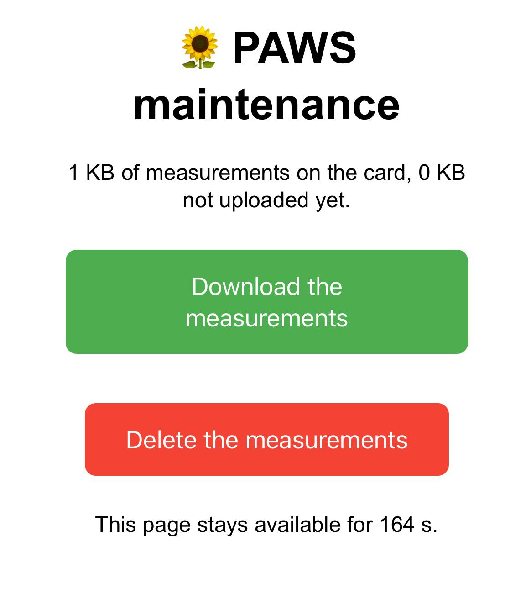
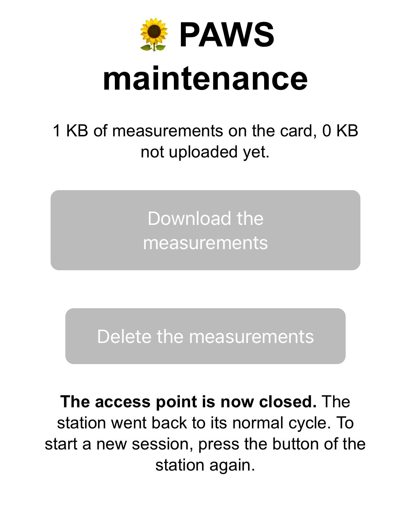

# A5 · Maintenance Mode {.unnumbered}

Step A5 replaces the last skeleton adapter: the maintenance mode (F5 · Maintenance mode). When the home Wi-Fi is out of reach, the data can still be retrieved without opening the enclosure: a press on the button starts a Wi-Fi network created by the station itself (an *access point*), and a web page to download or delete the measurements from a phone. After 3 minutes, the station goes back to its normal cycle.

The PoC already did this in [Fallback AP](../../PoC/Phase-03/03-fallback-ap.qmd). The state machine already handles the path (`BOOT` → `MAINTENANCE` → `MEASURE`) since A1: only the adapter and the button wake-up are new.

> **Ready-to-use project:** The complete code of this step is available in the repository here: [`firmware/paws`](https://github.com/wg1d/personal-autonomous-weather-station/tree/main/firmware/paws)

## Wiring

The button is the one of the PoC ([Fallback AP](../../PoC/Phase-03/03-fallback-ap.qmd)):

| Button | ESP32 | Role |
|--------|-------|------|
| One side | 3.3V | |
| Other side | Pin 39 | Reads high while the button is pressed |
| Pin 39 | 10 kΩ to GND | Pull-down: the pin reads low when the button is released |

## The button wake-up

The power adapter now arms a third wake-up source, `EXT1`, on pin 39:

```{.cpp include="../../../../firmware/paws/src/adapters/Esp32Power.h"}
```

`EXT1` can watch several pins at once, selected by a bit mask: `1ULL << kButtonPin` sets the bit of pin 39 only. `ESP_EXT1_WAKEUP_ANY_HIGH` wakes the ESP32 up as soon as this pin goes high, when the button is pressed. At the next boot, the wake-up cause is `Button`, and `BOOT` goes to `MAINTENANCE`.

## The SD card, shared

The maintenance mode also reads and deletes the files of the SD card. To avoid writing the power-up code twice, the parts of the card used by both adapters move to a small shared header:

```{.cpp include="../../../../firmware/paws/src/adapters/SdCard.h"}
```

::: {.callout-tip collapse="true"}
## C++: `inline` functions in a header

A function defined in a header is copied into every source file (`.cpp`) that includes it. If two source files included `SdCard.h`, the linker would find two definitions of `sdMount()` and refuse to build the firmware. `inline` tells it that these copies are the same function. Today, only `main.cpp` includes this header, but `inline` keeps it safe to include anywhere, and makes it possible to keep short helpers next to their constants.
:::

The storage adapter of A3 and A4 now uses these helpers:

```{.cpp include="../../../../firmware/paws/src/adapters/SdStorage.h"}
```

## The maintenance adapter

```{.cpp include="../../../../firmware/paws/src/adapters/AccessPointMaintenance.h"}
```

`run()` works in four steps:

1. **Power the card on** for the whole session, since the page reads and deletes its files.
2. **Start the access point** with the name and password of `secrets.h`. The ESP32 gives itself the address `192.168.4.1` on this network.
3. **Serve the page** with `WebServer`, the web server of the ESP32 Arduino core. It is *synchronous*: `handleClient()` handles the requests waiting, then returns. The loop calls it until the end of the session, which fits `run()`: it blocks during the session, then gives control back to the state machine.
4. **Stop everything**: web server, access point, Wi-Fi radio and card.

{width=300}

The page shows the state of the card before any action: its size, and how much of it the server does not have yet (the bytes after the upload cursor). When the card is empty, the two buttons are disabled.

- **Download** sends the CSV file with `streamFile()`, read from the card piece by piece. The `Content-Disposition: attachment` header asks the phone to save the file instead of displaying it.
- **Delete** asks for a confirmation in the browser, then removes the CSV file and the upload cursor, which points into the deleted file. The next measurement creates a new file, and the next upload starts at its beginning. The station then sends the phone back to the main page with a `303` code ("see other"), instead of answering the deletion itself: reloading the page cannot send the deletion a second time. The script of the page then puts the address back to `/`, so that the message is shown only once.
- **The time left** is computed by the station when it sends the page, then counted down by a small script in the browser. At 0, the script tells that the access point is closed and disables the buttons: the station has already gone back to its normal cycle.

{width=300}

Any other address answers "not found", without an error message: browsers ask for `/favicon.ico`, the icon of the tab, which the page already provides as an emoji.

::: {.callout-tip collapse="true"}
## C++: lambdas

`server.on("/", HTTP_GET, [this, &server]() { ... });` gives the web server a *lambda*: a small function without a name, written where it is used. The server calls it when a phone asks for this address. The brackets list what the lambda can use from around it: `this` to call the functions of the adapter, and `&server` (by reference) to answer the request. Without lambdas, each address would need a separate function, written far from the place where the address is declared.
:::

## Settings

The name and password of the access point live in `include/secrets.h`, next to the Wi-Fi and server settings:

```{.cpp include="../../../../firmware/paws/include/secrets.example.h"}
```

The station creates this network, so the name and password are free. The name has at most 32 characters; avoid the name of the home Wi-Fi, which would confuse the phone. The password needs 8 to 63 characters (WPA2), and should be a real one: during a session, anyone in range who knows it could delete the measurements.

## main.cpp

`main.cpp` creates an `AccessPointMaintenance` with the settings of `secrets.h`, instead of the skeleton adapter of A1. All the adapters are now the real ones:

```{.cpp include="../../../../firmware/paws/src/main.cpp"}
```

## Expected output

After a press on the button, our board printed this session, during which we downloaded the measurements, then deleted them:

```text
-> BOOT
-> MAINTENANCE
   access point "PAWS-maintenance" started, page: http://192.168.4.1
   measurements downloaded
   measurements deleted
E (184618) wifi_init_default: netstack cb reg failed with 12308
   access point stopped
-> MEASURE
-> STORE
   stored: 2026-10-03T13:32:45Z,1,26.17,47.90,1006.04
-> SCHEDULE
   alarm set for 13:33:00
-> SLEEP
   RTC alarm: yes, button: yes, timer: 75 s
   awake for 182711 ms
...
-> BOOT
-> MEASURE
-> STORE
   stored: 2026-10-03T13:33:00Z,1,26.21,47.84,1006.03
```

- On the phone, connect to the `PAWS-maintenance` network, then open `http://192.168.4.1`, with `http://`: some browsers would otherwise search for the address on the internet.
- After 3 minutes, the access point stops, and the station takes a measurement right away: the alarms that fell during the session were not handled. `SCHEDULE` then realigns the station on the grid (`13:33:00`). With the real interval of 15 minutes, a session delays at most one measurement by a few minutes.
- The row of `13:32:45` starts a new file, since the measurements were deleted.
- The line `E (184618) wifi_init_default: ...` is printed by the Wi-Fi stack of the ESP32 when the access point stops. The Wi-Fi works normally afterwards: the next upload connects as usual.

## Troubleshooting

| Symptom | Cause and fix |
|---------|---------------|
| The button does not wake the station up | Check the wiring of pin 39 and its pull-down resistor. Without it, the pin floats and may also wake the station up at random. |
| The `PAWS-maintenance` network does not appear | The password has fewer than 8 characters: the ESP32 refuses to create the network. |
| The phone is connected, but the page does not open | The network has no internet access, and the phone switched to its mobile data. Choose to stay connected to the network, or turn the mobile data off during the session. |
| "SD card not found." on the page | The card is missing or not mounted: the measurements cannot be downloaded or deleted. |

## Next Steps

Every adapter is now real: the station measures, stores, uploads, keeps its clock exact, and can be serviced from a phone. Step A6 hardens it: watchdog, a review of the error handling, and the durations measured in the previous steps compared with the energy estimate.
