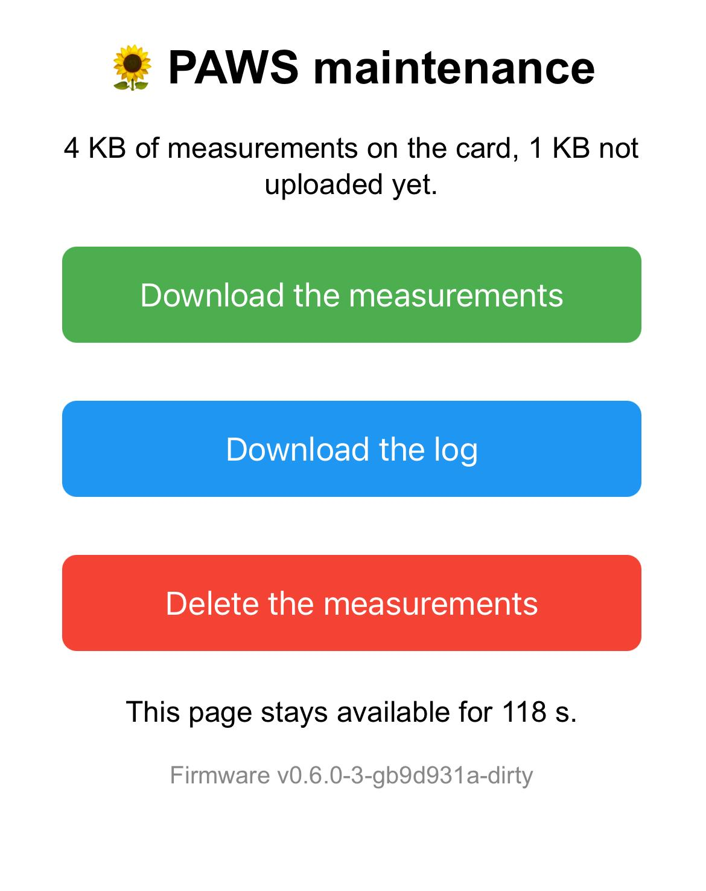

# A6 · Log {.unnumbered}

On the bench, the serial monitor shows everything the station does: the states it goes through, the errors, the durations. Outdoors, nobody watches the serial port, and these lines are lost. This chapter keeps them in a **log**: a text file on the SD card, with one entry per wake-up, which can be downloaded from the maintenance page and is uploaded to the server with the measurements.

The log is a help to understand what happened, not data: if it cannot be written, the measurements are not affected.

## The console

The adapters used to print with `Serial`. They now print with `console`, an object that prints to the serial port in the same way, and also keeps a copy of everything printed during the wake-up:

```{.cpp include="../../../../firmware/paws/src/adapters/Console.h"}
```

`Console` inherits from `Print`, the Arduino class that provides `print()`, `println()` and `printf()`, like `Serial`. All of them end up calling `write()` for each character: redefining this single function is enough to send each character to the serial port, and to keep it in a buffer of 4 KB, about ten times what a usual wake-up prints. The buffer is in RAM, so it starts empty at each wake-up. If the buffer is full, the remaining characters still go to the serial port, and the log entry says that it was truncated.

::: {.callout-tip collapse="true"}
## C++: `extern`

`extern Console console;` *declares* the object: it tells every file that includes `Console.h` that an object named `console` exists somewhere. `main.cpp` *defines* it, once, with `Console console;`. The adapters can then use it like `Serial`, which the Arduino core declares and defines the same way. A global object is usually avoided; here, it follows the model of `Serial`, which the reader already knows.
:::

## The log file

At the end of the wake-up, `close()` of the storage appends the copy kept by the console to `/log.txt`, before powering the card off:

```{.cpp include="../../../../firmware/paws/src/adapters/SdStorage.h"}
```

- Each entry starts with a blank line and the timestamp of the row of the wake-up (`=== 2026-10-04T15:09:31Z ===`), then the lines printed during the wake-up.
- The last line of each entry gives the awake time, measured just before the card is powered off (N3 · Energy).
- When `/log.txt` exceeds 1 MB, about a month of wake-ups with the periods of the design, it becomes `/log.old` (the previous one is deleted), and a new `/log.txt` starts: the log never takes more than about 2 MB on the card. The lines of the old file that were not uploaded yet are no longer sent, but stay on the card.

Here is an entry of the log of our board:

```text
=== 2026-10-04T15:09:31Z ===
PAWS firmware v0.6.0-3-gb9d931a-dirty (bench periods)
-> BOOT
-> MEASURE
-> STORE
   stored: 2026-10-04T15:09:31Z,1,23.07,58.28,1005.81
-> SCHEDULE
   alarm set for 15:10:00
-> SLEEP
   awake for 1396 ms
```

The lines printed by the ESP32 itself (boot messages, errors of the system) do not go through `console`, and are not in the log.

## Sending the log

The log is uploaded with the hourly upload, following the same rules as the measurements: its own cursor (`/log.idx`), requests of complete lines, and a cursor that moves only after the server confirmed. Rather than writing a second loop, the interfaces receive the kind of data with a small enumeration:

```{.cpp include="../../../../firmware/paws/lib/ports/Record.h"}
```

The core sends the measurements first, since they matter more, then the log, with the same function:

```{.cpp include="../../../../firmware/paws/lib/core/StateMachine.cpp"}
```

The storage chooses the file and the cursor from the kind of data, and the network chooses the address: `/api/v1/measurements` with the CSV header line, or `/api/v1/logs` with the lines as they are. Since the log of a wake-up is written at its very end, it is uploaded at the next upload.

Two scenario tests check the log on the computer: it is sent with the measurements, and kept when the server refuses the request.

## The test server

The test server receives the log on `POST /api/v1/logs`, appends it to the file `station.log`, and shows its last 200 lines at `http://localhost:8080/log`:

```{.python include="../../../../backend/Phase-04/test_server/main.py"}
```

The lines are inserted in the page with `html.escape()`, so that a character such as `<` in a log line cannot break the page.

## The maintenance page

The maintenance page gains a third button, **Download the log**, and shows the version of the firmware:

{width=300}

```{.cpp include="../../../../firmware/paws/src/adapters/AccessPointMaintenance.h"}
```

The buttons now have the same width, whatever their text, and the title fits on one line on a phone.

## Next Steps

The station now keeps a trace of what it does. The [last chapter](06-3-energy-and-review.qmd) of the step compares the energy estimate of the design with the durations measured on the board, and reviews the error handling.
