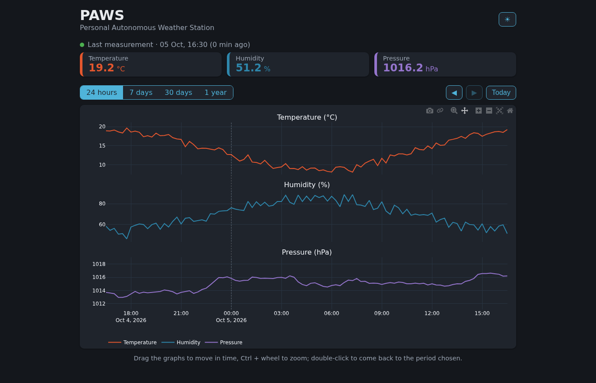
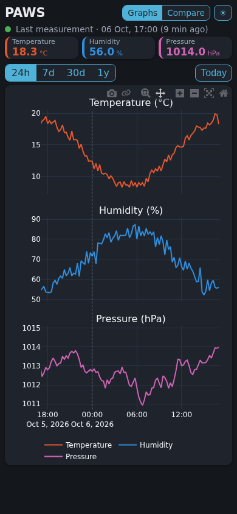

# B2 · Dashboard {.unnumbered}

Step B1 stores the data of the station on the server. Step B2 shows it in a dashboard, opened in a browser on a computer or a phone of the home network. This first part builds the page itself, and its first tab, Graphs:

- the last measurement, and the health of the station (BF3 · Dashboard, BF4 · Health of the station);
- the graphs of temperature, humidity and pressure, from a few hours to several years, with the minimum, average and maximum of each day over long periods (BF3).

The second tab, Compare, draws two periods over each other (BF6): it is the subject of the [next chapter](02-2-compare.qmd). The third one, [Data](02-3-data.qmd), exports the measurements (BF5) and receives the files of the station uploaded by hand (BF7).

> **Ready-to-use project:** The complete code of this step is available in the repository here: [`backend/paws`](https://github.com/wg1d/personal-autonomous-weather-station/tree/v0.9.0/backend/paws)

## The page



From the top to the bottom:

- **The tabs**, Graphs, Compare and Data, and the button that switches between a dark and a light theme; the browser remembers the theme.
- **The last measurement**: a dot, green while the station sends its data, and the time of the last row, then one card per quantity with its value. The station measures every 15 minutes: the cards show the last measurement, not the weather of this very second.
- **A red warning**, only when the station is silent: after 2 hours without a new row, a red band appears below the title, for example "No new measurement for 3 h 05 min: check the station." The station uploads every hour: 2 hours without data mean that it missed an upload.
- **The period**: 24 hours, 7 days, 30 days or 1 year, and **Today**, which comes back to the present.
- **The graphs**, one per quantity, one above the other, sharing the same time axis. A dotted line marks each midnight.

To move in time, **drag the graphs** to the left or to the right: the three graphs move together, and the values keep their scale. **The mouse wheel** zooms in or out in time, around the mouse. Neither goes beyond the data: not before the oldest row, not after the present. The period buttons then only set the length shown again.

The points depend on the length shown: every row up to 2 days, the average of each hour up to 3 months, then the minimum, average and maximum of each day, drawn as the average inside a band that goes from the minimum to the maximum. The screen shows no more detail, and the page stays light.

While the graphs show the present, the page asks for new data every 5 minutes.

On a phone, everything above the graphs is made smaller, and the periods are written in short (24h, 7d, 30d, 1y), so that the graphs and their time axis fit on the screen:

{width=300}

The dashboard is served by the backend itself, on the same port as the API: `http://192.168.1.28:8080` (the address of the server) opens it; `/` sends the browser to `/dashboard/`.

## Dash

[Dash](https://dash.plotly.com/) builds web pages in Python. A Dash application has two parts:

- **the layout**: the elements of the page, written as Python objects, such as `html.H1("PAWS")` for a title, `dcc.RadioItems` for the period buttons, or `dcc.Graph` for the graphs. Dash turns them into HTML in the browser;
- **the callbacks**: Python functions that Dash calls when an element changes in the browser, such as a click on a button. They receive the values of some elements (the *inputs*), and return new values for others (the *outputs*).

In the browser, the graphs are drawn by [Plotly](https://plotly.com/javascript/), a JavaScript library: the callback only sends the data and the description of the figure. The zoom, the drag and the values shown under the mouse all happen in the browser, without asking the server.

Dash runs on Flask, an older kind of Python web application, called *WSGI*; FastAPI is an *ASGI* application, its newer version. The `a2wsgi` package lets FastAPI serve the Dash application under `/dashboard`, so that the API and the dashboard share one service and one port (BN2 · Light):

```{.python include="../../_versions/v0.9.0/backend/paws/paws_server/main.py"}
```

## The queries

The dashboard reads the database with five new functions:

```{.python include="../../_versions/v0.9.0/backend/paws/paws_server/database.py"}
```

- **`last_row()`** gives the last measurement, for the cards and the health of the station.
- **`first_local_time()`** gives the time of the oldest row: the graphs cannot go before it.
- **`rows_between()`** gives the rows of a period, up to 2 days. SQLite also gives the time of each row in the local time of the server (`datetime(timestamp, 'localtime')`): the database stores UTC, but the graphs show the time of the house.
- **`hourly_summary()`** gives the average of each hour, up to 3 months, placed at the middle of the hour.
- **`daily_summary()`** gives the minimum, average and maximum of each day, beyond 3 months.

Each summary is a single SQL query: `GROUP BY` gathers the rows of the same hour or day, and `MIN()`, `AVG()` and `MAX()` compute their values. A missing value (`NULL`) is ignored by these functions.

Only the rows with a valid time (`time_valid = 1`) are shown: a row measured while the clock was not reliable may carry a wrong date, such as `2000-01-01`.

The days of `daily_summary()` are days in UTC: the first ten characters of the timestamp, its date. In France, such a day starts at 1:00 or 2:00 in the night instead of midnight, which changes little to its minimum, average and maximum. Grouping the rows by local day would need to convert each of them first: for three years of rows, it takes 6 seconds on the server, against 1.5 seconds in UTC.

## The dashboard

`dashboard.py` holds the whole page:

```{.python include="../../_versions/v0.9.0/backend/paws/paws_server/dashboard.py"}
```

It is organized in five parts; this chapter explains four of them, the [next one](02-2-compare.qmd) the Compare tab. The callbacks of the Data tab are described [with it](02-3-data.qmd#in-the-dashboard).

**Navigation in time.** The page keeps the period shown in a `dcc.Store`, a value kept in the browser, without anything on the screen: its length, and its end, which is `None` while the page shows the present. `shown()` computes the start and the end of the period from it.

The drag and the zoom are done by Plotly itself, in the browser (`"dragmode": "pan"` and the `scrollZoom` option). After each move, Plotly tells the page the new limits of the time axes (`relayoutData`): `shown_limits()` reads them, and `view_after_move()` turns them into the new period shown. The page then loads the data around the new position, at the resolution of the new length (`resolution()`).

To show the data right away while the graphs are dragged, they hold more than the period shown: as much again on each side. The data beyond appears once the mouse is released.

The limits of the data are given to the time axes (`"minallowed"` and `"maxallowed"`): Plotly stops a drag or a zoom at them. At a limit, Plotly stops the edge that reached it, and lets the other one move on: the graphs then show a shorter period.

**Health and last measurement.** `health()` computes the age of the last row and decides whether the station is silent (more than 2 hours); `cards()` builds one card per quantity.

**Graphs.** `figure()` builds the three graphs. A Plotly figure is a dictionary, in the format that the JavaScript library reads in the browser:

- `"data"` holds the curves: for each one, its points (`"x"`, `"y"`), its color, and its axes;
- `"layout"` holds everything around them: the axes, the titles, the legend, the dotted lines (`"shapes"`) and the colors of the theme.

Plotly names the axes `x`, `x2`, `x3` and `y`, `y2`, `y3`. Each graph has its own value axis, placed by its `"domain"`, the part of the height of the figure it takes. The three time axes are linked (`"matches": "x"`): moving one moves the others.

Over a year, each quantity has three curves: the minimum, drawn without a line, then the maximum, filled down to the previous curve (`"fill": "tonexty"`), which draws the band between them, then the average.

**The page.** `create_dashboard()` writes the layout and the callbacks:

- `show_tab()` shows the tab chosen and hides the other one;
- `navigate()` is called on a click on a period or on Today, or after a drag or a zoom; `ctx.triggered_id` tells which element changed. It returns the new period shown;
- `switch_theme()` is called on a click on the theme button;
- `update()` is called when the page opens, when the period shown or the theme changes, and every 5 minutes (`dcc.Interval`). It reads the database and returns everything the Graphs tab shows.

`update()` delegates the work to `build_view()`, which takes the database and the current time as parameters: the tests call it directly, without a browser.

::: {.callout-tip collapse="true"}
## Python: `**` in a dictionary, and formats in f-strings

`{"type": "scatter", **axes}` copies all the keys of the dictionary `axes` into the new dictionary: here, `"xaxis"` and `"yaxis"`, which are the same for the curves of one graph.

In an f-string, what follows `:` inside the braces is a *format*: `f"{value:.1f}"` writes a number with one decimal, and `f"{moment:%d %b, %H:%M}"` writes a date, such as `05 Oct, 14:45`, with the codes of `strftime()`.
:::

## The style

The colors, sizes and layout of the page are in a style sheet, `assets/style.css`. Dash adds every file of the `assets` folder to the page, next to the application.

::: {.callout-note collapse="true"}
## style.css

```{.css include="../../_versions/v0.9.0/backend/paws/paws_server/assets/style.css"}
```

The two themes only differ by the values of a few *CSS variables*, such as `--background` or `--card`, given by the class of the outermost element (`root dark` or `root light`). The rules below use these variables, and the callback only changes this class. The components of Dash, such as its lists, take their colors from variables of their own (`--Dash-…`), set from the same values.

The rules inside `@media (max-width: 600px)` only apply to a narrow screen, such as a phone. Each period button holds a long and a short label; the style shows one or the other.
:::

## Speed on the server

The first version of the dashboard built its figure with the figure objects of Plotly (`plotly.graph_objects`), which check every value they receive. On the development computer, the page was fast. On the server, with three years of made-up data, we measured how long the server took to answer:

| Period | Figure objects of Plotly | Dictionary |
|--------|--------------------------|------------|
| 24 hours | 2.7 s | 0.14 s |
| 7 days | 16 s | 0.5 s |
| 30 days | 69 s | 1.1 s |

A 30-day view with its margins held about 8,600 rows: the figure objects checked each of their 26,000 values, and the dotted lines one by one, on a processor much slower than the one of the development computer. Written as a dictionary, the figure is sent as it is: Plotly checks it in the browser anyway. The local time of each row is also given by SQLite, three times faster than Python on the server.

The averages of each hour and of each day then cut the number of points. With the current code, the server builds each view in 0.02 s (24 hours), 0.06 s (7 days), 0.23 s (30 days) and 1.2 s (1 year), with three years of data.

Measuring on the real server, and with realistic amounts of data, showed the problem; the development computer hid it.

## The tests

The tests of the dashboard call its functions directly, with a temporary database:

```{.python include="../../_versions/v0.9.0/backend/paws/tests/test_dashboard.py"}
```

- **The health**: no data, a recent row, and a row older than 2 hours.
- **The navigation**: the period ends now by default; the limits that Plotly reports for its three time axes are read; a drag or a zoom sets the period shown, and coming back to the present follows the new data again; the resolution follows the length shown.
- **The queries**: the rows outside the period and those with an invalid time are left out; the averages of each hour, and the minimum, average and maximum of each day, ignore the missing values.
- **The view**: one curve per quantity over a day, three over a year (minimum, band, average), the margin on each side, and the limits of the data on the three time axes.

The dashboard shows local time, which depends on the computer running the tests. The fixture `utc_local_time` sets the local time to UTC during each test (the `TZ` environment variable, then `time.tzset()` to apply it): the results are the same on any computer, and in the CI.

The tests of the API also check that `/` sends the browser to the dashboard, and that the dashboard is served under `/dashboard/`.

## Trying it with made-up data

Without the station, the database of the development computer is empty. A small script fills a database with three years of made-up measurements, one every 15 minutes: the temperature follows the seasons and the hours of the day, the humidity goes the other way, and the pressure drifts slowly, as weather systems pass.

::: {.callout-note collapse="true"}
## make_test_data.py

```{.python include="../../_versions/v0.9.0/backend/paws/dev/make_test_data.py"}
```
:::

From the root of the repository, this command makes the data again, then starts the backend on it:

```bash
pixi run backend-demo
```

and the dashboard opens at `http://localhost:8080`. The made-up data lives in `backend/paws/dev/data`, ignored by git, and never reaches the server.

## On the server

The dashboard is deployed like the rest of the backend:

```bash
pixi run deploy-backend
```

On our server, the service now uses about 47 MB of memory for the backend itself, Dash included, and 25 MB for the `uv run` process that launched it.

## Troubleshooting

| Symptom | Cause and fix |
|---------|---------------|
| The page stays white | The browser cannot load the scripts of the page: reload it. If it stays white, `journalctl -u paws-backend -n 50` on the server shows the errors of the callbacks. |
| The graphs are empty | No row in the period shown: press **Today**, or choose a longer period. Rows written while the clock was not reliable (`time_valid = 0`) are never shown. |
| The graphs shrink when dragged | They reached the oldest row or the present: Plotly stops that edge, and the other one moves on. Press a period button to show its length again. |
| The dot is red after a deployment | The deployment does not change the data: the station has not uploaded for 2 hours. Check its log on the maintenance page, or `station.log` on the server. |
| The times are one or two hours off | The server is not set to the local time zone: `timedatectl` on the server shows it, `sudo timedatectl set-timezone Europe/Paris` sets it. |

## Next Steps

The [next chapter](02-2-compare.qmd) describes the Compare tab, which draws two days, weeks, months or years over each other.
