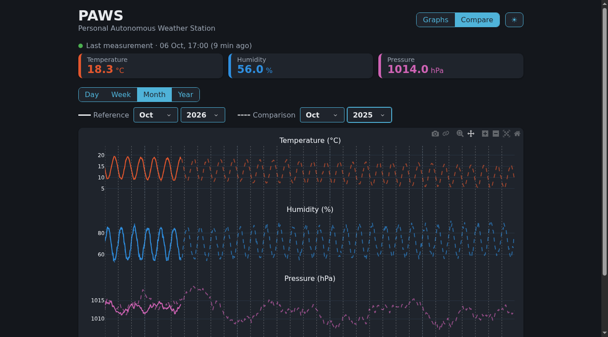
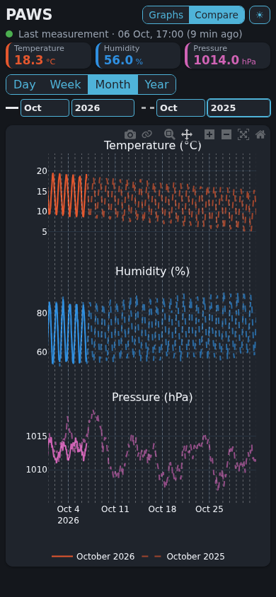

# B2 · Compare {.unnumbered}

The second tab of the [dashboard](02-1-dashboard.qmd), Compare, draws two periods over each other (BF6 · Compare periods): this October against the last one, or this week against the previous week. The two curves start at the same place on the left of the graphs, so that the same moment of each period is drawn at the same place: the 10th of each month, or the Tuesday of each week.

## The tab

- **The unit**: Day, Week, Month or Year. When it changes, the tab compares the current period with the one before: today with yesterday, this month with the last one.
- **The reference and the comparison**, each chosen in short lists: the day, the month and the year for a day; the week number and the year for a week; the month and the year for a month; the year for a year. Comparing October 2026 with October 2025 only needs to change the year of the comparison.
- **The graphs**: the reference in solid lines, the comparison in the same colors, paler and dashed. The marks before the lists show which line belongs to which period, and the legend names them, such as "October 2026" and "October 2025".

As in the Graphs tab, dragging the graphs and turning the mouse wheel move and zoom in time: both periods move together, so that the gap between them stays the same. The legend then gives the exact times shown, such as "05 Sep 2026 → 06 Oct 2026". The lists keep the periods chosen: choosing a period again brings the graphs back to its start.

On a phone, the lists share one line, with the marks of the lines but without their names:

{width=300}

## The code

The Compare tab is the fifth part of `dashboard.py`, shown in the [previous chapter](02-1-dashboard.qmd#the-dashboard). The page keeps the two periods compared in a `dcc.Store`: the unit, the length shown, the start of each period, and whether they are still the periods chosen in the lists.

**Choosing the periods.**

- `unit_start()` and `unit_length()` give the first day and the length of a day, a week (from Monday), a month or a year.
- `start_of()` turns the values of the lists into the first day of a period. A month has 28 to 31 days, and a year 52 or 53 weeks: the 31st of February is the last day of February, and the week 53 of a year of 52 weeks is its last week.
- `compare_dates()` turns the first days of the two periods into the periods compared. The graphs show the length of the reference: a comparison of 30 days is drawn over the 31 days of October, and goes one day into the next month.

**Drawing them.** `build_comparison()` reads the data of each period at the same resolution, then moves the points of the comparison so that it starts where the reference starts (`moved()`): the comparison is drawn on the time axis of the reference. `figure()`, the same function as for the Graphs tab, then draws the curves of the comparison paler and dashed.

The limits of the drag are computed on the axis of the reference: neither period may go before the oldest row, nor after the present. The periods chosen always fit within them: the current month, for example, goes on after the present.

**Moving them.** After a drag or a zoom, `compare_after_move()` moves both starts by the same distance, and sets the new length shown.

**The callbacks.** `choose_periods()` is called when the unit or a list changes, and after a drag or a zoom; `update_comparison()` then draws the graphs. The lists are not changed after a move: Dash would take their new values for a new choice, and bring the graphs back to the start of the periods.

## The tests

The tests of the Compare tab, in `test_dashboard.py`, check that:

- any value of the lists gives the right first day, including the 31st of February and the week 53;
- October 2026 and December 2025 are drawn over each other: a row one hour after the start of each month is drawn at the same place;
- after a drag, both periods have moved by the same distance, and the legend gives the exact times shown.

## Speed on the server

With three years of made-up data, the server builds the comparison of two months in 0.65 s, and of two years in 2.6 s: two years of daily values are read for each period, with a margin on each side to drag into.

## Troubleshooting

| Symptom | Cause and fix |
|---------|---------------|
| One of the curves is empty | No row in that period: the station was not running yet, or its clock was not reliable. |
| The graphs no longer show the periods chosen | They were dragged or zoomed: choose a period again in the lists to come back to its start. |
| The legend gives times instead of a name | Same cause: after a move, the legend gives the exact times shown. |

## Next Steps

The [last part of B2](02-3-data.qmd) adds the Data tab: the export of the measurements as a CSV file (BF5), and the manual upload of the files downloaded from the maintenance page of the station (BF7).
