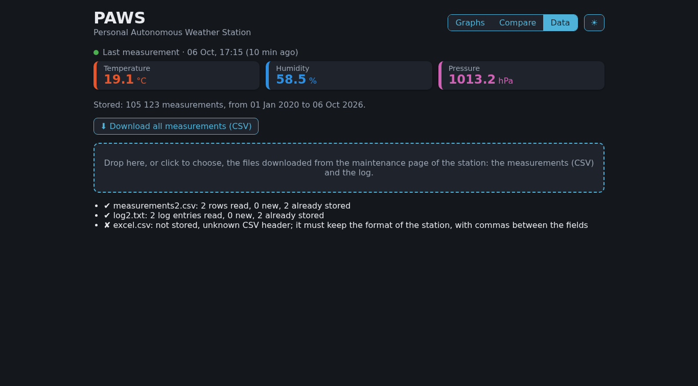

# B2 · Data {.unnumbered}

The third tab of the [dashboard](02-1-dashboard.qmd), Data, takes the measurements out of the server, and brings in those that the station could not send:

- **the export** of all the measurements, as a CSV file (BF5 · Export), to analyze them elsewhere, or for the forecasting of the next phase;
- **the manual upload** of the files downloaded from the [maintenance page](../Architecture/Phase-04/05-1-maintenance-mode.qmd) of the station (BF7 · Manual upload): when the station cannot reach the home Wi-Fi, its data is retrieved with a phone, then sent to the server from the dashboard.

> **Ready-to-use project:** The complete code of this step is available in the repository here: [`backend/paws`](https://github.com/wg1d/personal-autonomous-weather-station/tree/v0.9.0/backend/paws)

## The tab



- **The measurements stored**: their number, and the dates of the oldest and of the newest one.
- **⬇ Download all measurements (CSV)**: the browser saves a file named after the day, such as `paws_measurements_2026-10-06.csv`.
- **The upload area**: drop the files on it, or click it to choose them; several files can be sent at once. For each file, a line tells what became of it.

## The export

`export_csv()` writes all the measurements, oldest first, in the format of the station ([CSV format v1](../Architecture/Phase-04/00-3-data-and-upload.qmd#csv-format)): the same header, two decimals, and an empty field for a missing value. A file exported by the dashboard can therefore be uploaded again: exporting three years of made-up data, starting again from an empty database and uploading the file gave back the same 105,123 rows, and a second export the same file.

## The manual upload

The maintenance page of the station gives two files: the measurements, and the log. `import_file()` recognizes them by their content, not by their name:

- **a file starting with `timestamp`** holds measurements. It is checked like an upload of the station: a malformed file is refused as a whole, and nothing is stored. Then the rows whose timestamp is already stored are ignored, as for the station: only the new ones are inserted;
- **a file holding entries of the log** is a log: each entry starts with a line holding its time, such as `=== 2026-10-04T15:25:00Z ===`. An entry whose first line is already in the log of the server was already sent by the station: only the other entries are added, at the end of the log;
- **any other file** is refused.

A spreadsheet such as Excel, in French, saves a CSV file with `;` between the fields and `,` in the numbers: such a file is refused, with a message asking to keep the format of the station.

```{.python include="../../_versions/v0.9.0/backend/paws/paws_server/transfer.py"}
```

The log of the server moves to a module of its own, `logs.py`, used both by the API, which appends the lines sent by the station, and by the manual upload, which merges the entries of a file:

```{.python include="../../_versions/v0.9.0/backend/paws/paws_server/logs.py"}
```

## In the dashboard

Two components of Dash do the work in the browser:

- **`dcc.Download`** receives the file from the callback `export()`, and has the browser save it;
- **`dcc.Upload`** reads the files chosen, and gives them to the callback `show_data()`, written in *base64*: bytes turned into text, to travel with the rest of the page. `decode_upload()` turns them back into text. The callback then forgets the files, so that the same file can be sent again.

`show_data()` also writes the summary of the measurements stored, when the tab is chosen and after each upload.

## The tests

`test_transfer.py` checks that:

- the export has the format of the station, oldest first;
- a file of measurements only stores its new rows, and a malformed one stores nothing;
- a file saved by a spreadsheet, and any other file, are refused, and not taken for a log;
- a log only adds its new entries, cut at their first line.

```{.python include="../../_versions/v0.9.0/backend/paws/tests/test_transfer.py"}
```

## Speed on the server

On the server, with three years of made-up data, the export takes 7.6 s, and uploading the whole export into an empty database 29 s. The files of the maintenance page usually hold a few days of measurements: their upload takes a fraction of a second.

## Troubleshooting

| Symptom | Cause and fix |
|---------|---------------|
| `not stored, unknown CSV header` | The file was saved again by a spreadsheet, or is not a file of the station: upload the file downloaded from the maintenance page, as it is. |
| `not stored, malformed row` | A row does not follow the format of the station: the message gives it. Nothing of the file is stored. |
| `0 new` for every row | The station had already uploaded these rows: nothing is lost, nothing is stored twice. |

## Next Steps

Step B2 is complete: the dashboard shows, compares, exports and receives the measurements. The backend is published as version `v0.9.0`. Step B3 makes the data safe: a daily backup of the database, copied outside the house, and a server that comes back on its own after a reboot.
