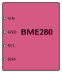
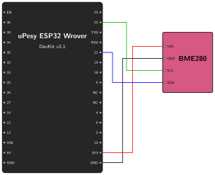

# Data Acquisition {.unnumbered}
Let's start working on how to collect data from our environment. In this chapter, we will focus on the sensors, which involves two steps:

1. Connect the sensor (BME280) to the ESP32 on a breadboard.
2. Program the ESP32 to collect data from the sensor.

## Connect the BME280 to the ESP32

The BME280 sensor measures temperature, humidity, and atmospheric pressure, it's a perfect match to start building our weather station.

### The I2C Interface
To communicate with the ESP32, the BME280 uses a digital communication protocol called **I2C** (Inter-Integrated Circuit).

I2C is a very popular communication protocol for microcontrollers because it allows you to connect multiple sensors to the same two pins. It uses two lines:
*   **SCL (Serial Clock):** Synchronizes the data transfer.
*   **SDA (Serial Data):** Carries the actual data.

Each sensor on the I2C "bus" has a unique address (like a house number) so the ESP32 knows exactly which sensor it's talking to.

### Pinout

The BME280 module typically has 4 pins (we will focus on the I2C version):

*   **VIN:** Power supply input (3.3V).
*   **GND:** Ground connection.
*   **SCL:** Serial Clock for I2C communication.
*   **SDA:** Serial Data for I2C communication.

{width=150}

### Wiring the Components
The ESP32 has default pins for I2C communication. We will connect the BME280 as follows:

*   **VIN:** Connect to the ESP32 **3.3V** pin.
*   **GND:** Connect to an ESP32 **GND** pin.
*   **SCL:** Connect to ESP32 Pin **22**.
*   **SDA:** Connect to ESP32 Pin **21**.

{width=500}

## Program the ESP32 to Read the BME280

### Setup
Now that the sensor is wired, let's write a simple program to read the data and print it to the Serial Monitor. We'll put this in a loop with a small delay so it continuously outputs the readings.

If you are using the standard Arduino IDE, you will need to manually install the **Adafruit BME280 Library** and the **Adafruit Unified Sensor** library using the Library Manager.

However, if you are using **PlatformIO** (which we highly recommend), dependency management is fully automated! You simply declare the libraries you need in your `platformio.ini` file, and PlatformIO will download them automatically the first time you compile.

Here is the `platformio.ini` configuration for this project:

```ini
[platformio]
src_dir = .

[env:upesy_wrover]
platform = espressif32
board = upesy_wrover
framework = arduino
monitor_speed = 115200
lib_deps =
    adafruit/Adafruit BME280 Library @ ^2.2.4
```

> **Ready-to-use project:** If you don't want to copy-paste, you can directly open the complete PlatformIO project from the source code here: [`01_data_acquisition`](https://github.com/wg1d/personal-autonomous-weather-station/tree/main/firmware/Phase-01/01_data_acquisition)

### The Code

Here is the code to read the sensor:

```cpp
/*
 * Project: Personal Autonomous Weather Station
 * Phase 01: Data Acquisition
 * File: 01_data_acquisition.ino
 * 
 * Description:
 * This sketch initializes the BME280 sensor and continuously reads 
 * the temperature, humidity, and atmospheric pressure. 
 * The data is printed to the Serial Monitor every 5 seconds.
 * 
 * Wiring (ESP32 Wrover -> BME280):
 * - 3V3 -> VIN
 * - GND -> GND
 * - Pin 21 -> SDA
 * - Pin 22 -> SCL
 * 
 * Dependencies:
 * - Adafruit BME280 Library
 * - Adafruit Unified Sensor Library
 */

#include <Adafruit_Sensor.h>
#include <Adafruit_BME280.h>

Adafruit_BME280 bme; // Create a BME280 object

void setup() {
  Serial.begin(115200);
  Serial.println("BME280 Initialization Test");

  // Initialize the BME280 sensor using default I2C pins (SDA=21, SCL=22)
  // The default I2C address for most BME280 modules is 0x76 (sometimes 0x77)
  if (!bme.begin(0x76)) {
    Serial.println("Could not find a valid BME280 sensor, check wiring!");
    while (1); // Halt if sensor not found
  }
}

void loop() {
  // Read data from the sensor
  float temperature = bme.readTemperature(); // In Celsius
  float humidity = bme.readHumidity();       // In %
  float pressure = bme.readPressure() / 100.0F; // In hPa

  // Print the results to the terminal
  Serial.print("Temperature: ");
  Serial.print(temperature);
  Serial.println(" *C");

  Serial.print("Humidity: ");
  Serial.print(humidity);
  Serial.println(" %");

  Serial.print("Pressure: ");
  Serial.print(pressure);
  Serial.println(" hPa");

  Serial.println("-------------------------");

  // Wait for 5 seconds before taking the next reading
  delay(5000); 
}
```

### Code Explanation

Here is a quick breakdown of what the code is doing:

1. **`Adafruit_BME280 bme;`**: This creates an object named `bme` that we use to interact with the sensor via the Adafruit library.
2. **`bme.begin(0x76)`**: This initializes the sensor on the I2C bus using the specific address `0x76` (common for BME280 modules). If it returns false, it means the ESP32 cannot communicate with the sensor (likely a wiring issue).
3. **`bme.readTemperature()`, `bme.readHumidity()`, `bme.readPressure()`**: These functions retrieve the latest measurements from the sensor. Note that `readPressure()` returns the value in Pascals, so we divide it by `100.0F` to convert it to hectoPascals (hPa), which is the standard unit for weather forecasting.

Before running this code, make sure your ESP32 is connected to your computer via a **USB-C cable**. This connection is necessary to power the board, upload the program, and view the data coming back over the Serial connection.

Run this code, upload it to the ESP32, and open your Serial Monitor (set to 115200 baud). You should see the temperature, humidity, and pressure readings updating every 5 seconds!

### Expected Output
After building and uploading the code, you should see something like this in the Serial Monitor (if it's not the case, restart the esp by pressing the EN button):

```text
BME280 Initialization Test
Temperature: 29.31 *C
Humidity: 35.68 %
Pressure: 1000.12 hPa
-------------------------
Temperature: 29.36 *C
Humidity: 35.34 %
Pressure: 1000.10 hPa
-------------------------
Temperature: 29.41 *C
Humidity: 35.25 %
Pressure: 1000.14 hPa
-------------------------
```

With the sensor working, our next step is to make sure we don't lose this data when we power off the ESP32. We need to save it to an SD card.
