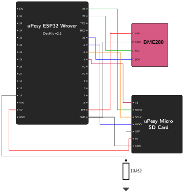

# Data Storage {.unnumbered}
Now that we are successfully acquiring data from the environment, we need to save it so it isn't lost when the ESP32 goes to sleep or loses power. 

This chapter will cover:

1. Connecting the micro SD card reader to the ESP32.
2. Programming the ESP32 to write our sensor data to the SD card.

## Connect the SD Card Reader to the ESP32

### The SPI Interface

The uPesy Micro SD card reader uses the **SPI** (Serial Peripheral Interface) protocol to communicate with the ESP32. 

Unlike I2C which uses only two wires, SPI is much faster but requires four wires to operate:

*   **MISO (Master In Slave Out):** Data from the SD card to the ESP32.
*   **MOSI (Master Out Slave In):** Data from the ESP32 to the SD card.
*   **SCLK (Serial Clock):** Synchronizes the data transfer.
*   **CS (Chip Select):** Used to select which SPI device to talk to.

### Power Saving with the OFF Pin

Unlike some other SD card readers, the uPesy Micro SD card module has an additional OFF pin that allows it to be turned off completely to save power via a logic signal. By default, if the pin is not used, the module is turned on. However, if we impose a LOW logic state (0V) to this pin, the module will be turned off, and so will the micro SD board. Imposing a HIGH logic state (3.3V or 5V) turns the module back on. For more information, check the [uPesy documentation](https://www.upesy.com/blogs/tutorials/upesy-microsd-module-quickstart-guide#).

**Hardware Tip:**
It's recommended to connect a pull-down resistor (e.g., 10kΩ) between the OFF pin and GND. This ensures that when the ESP32 goes into Deep Sleep and its pins become floating, the OFF pin is safely pulled LOW, guaranteeing the SD card reader stays powered off to save battery. 
 
**Why 10kΩ?**

This is a standard value that strikes the perfect balance. It is high enough to minimize current loss when the ESP32 drives the pin HIGH to turn the module on (only wasting ~0.33mA), but low enough to reliably pull the voltage down to 0V and prevent the pin from picking up random electrical noise when the ESP32 is sleeping. 
 
**What if I don't have a 10kΩ resistor?**

Any value between **4.7kΩ and 100kΩ** will work perfectly. The limits are determined by the datasheets of the ESP32 and the SD module:

- **Minimum ($R_{min}$):** Dictated by the ESP32's maximum output current. If the resistor is too small (e.g., 100Ω), driving it HIGH (3.3V) would draw 33mA ($I = V/R$), wasting battery and pushing the ESP32 pin near its absolute maximum limit (~40mA).
- **Maximum ($R_{max}$):** Dictated by the module's input leakage current and environmental noise. If the resistor is too large (e.g., 1MΩ), it creates a weak pull-down. Tiny leakage currents from the SD module's input pin ($I_{leakage}$) could create a voltage drop ($V = I_{leakage} \times R$) high enough to accidentally register as a logic HIGH. It also makes the wire act like an antenna, picking up random electromagnetic noise that could turn the module on.

### Wiring the Components

The ESP32 has default pins for SPI communication. Since we are building upon the data acquisition setup from the previous chapter, we will keep the BME280 sensor connected exactly as it was, and simply add the SD card module to the circuit as follows:

*   **VCC:** Connect to the ESP32 **5V** pin (the module regulates it down to 3.3V).
*   **GND:** Connect to an ESP32 **GND** pin.
*   **MISO:** Connect to ESP32 Pin **19**.
*   **MOSI:** Connect to ESP32 Pin **23**.
*   **SCLK:** Connect to ESP32 Pin **18**.
*   **CS:** Connect to ESP32 Pin **5** (can be changed).
*   **OFF:** Connect to ESP32 Pin **13** (can be changed).

{width=500}

## Program the ESP32 to Save Data

### Setup

We will build upon the code from the previous chapter. First, we need to include the necessary libraries to handle the SD card and the SPI communication. 

The `SD` and `SPI` libraries are built into the Arduino core for the ESP32, so you don't need to add any new dependencies to your `platformio.ini`. It should look like this:

```ini
[platformio]
src_dir = .

[env:upesy_wrover]
platform = espressif32
board = upesy_wrover
framework = arduino
monitor_speed = 115200
lib_deps =
    adafruit/Adafruit BME280 Library @ ^2.2.4
```

> **Ready-to-use project:** If you don't want to copy-paste, you can directly open the complete PlatformIO project from the source code here: [`02_data_storage`](https://github.com/wg1d/personal-autonomous-weather-station/tree/main/firmware/Phase-01/02_data_storage)

### The Code

Here is the updated code that reads the sensor and appends the data to a file on the SD card:

```cpp
/*
 * Project: Personal Autonomous Weather Station
 * Phase 01: Data Storage
 * File: 02_data_storage.ino
 * 
 * Description:
 * This sketch initializes the BME280 sensor and the SD Card module.
 * It continuously reads the temperature, humidity, and atmospheric pressure. 
 * The data is appended to a CSV file on the SD card every 5 seconds.
 * The SD card module is turned on only when writing data to save power.
 *
 * Wiring:
 * - BME280: 3V3 -> VIN, GND -> GND, Pin 21 -> SDA, Pin 22 -> SCL
 * - SD Card: 5V -> VCC, GND -> GND, Pin 19 -> MISO, Pin 23 -> MOSI, Pin 18 -> SCLK, Pin 5 -> CS
 * - SD OFF Pin -> Pin 13 (with a 10k pull-down resistor to GND)
 */

#include <Arduino.h>
#include <Wire.h>
#include <Adafruit_Sensor.h>
#include <Adafruit_BME280.h>
#include <SPI.h>
#include <SD.h>
#include <FS.h>

#define SD_CS_PIN 5
#define SD_OFF_PIN 13

Adafruit_BME280 bme;

// Helper function to append a string to a file on the SD card
void appendFile(fs::FS &fs, const char * path, const char * message) {
  File file = fs.open(path, FILE_APPEND);
  if (!file) {
    Serial.println("Failed to open file for appending");
    return;
  }
  if (!file.print(message)) {
    Serial.println("Append failed");
  }
  file.close();
}

void setup() {
  Serial.begin(115200);
  Serial.println("\nInitializing Weather Station...");

  // Initialize the OFF pin to turn on the SD card reader
  pinMode(SD_OFF_PIN, OUTPUT);
  digitalWrite(SD_OFF_PIN, HIGH);
  delay(100); // Give the module a moment to power up

  // Initialize BME280
  if (!bme.begin(0x76)) {
    Serial.println("Could not find a valid BME280 sensor, check wiring!");
    while (1) delay(10);
  }

  // Initialize SD Card
  if (!SD.begin(SD_CS_PIN)) {
    Serial.println("Card Mount Failed. Check wiring and make sure an SD card is inserted.");
    while (1) delay(10);
  }

  // Check if an SD card is actually attached
  uint8_t cardType = SD.cardType();
  if (cardType == CARD_NONE) {
    Serial.println("No SD card attached");
    while (1) delay(10);
  }

  // Create the CSV file header if the file doesn't exist
  if (!SD.exists("/weather_data.csv")) {
    File file = SD.open("/weather_data.csv", FILE_WRITE);
    if (file) {
      file.println("timestamp;temperature;humidity;pressure");
      file.close();
      Serial.println("Created weather_data.csv with header.");
    }
  }

  // Turn off the SD card module until we need to write
  digitalWrite(SD_OFF_PIN, LOW);
}

void loop() {
  // 1. Read data from BME280
  float temperature = bme.readTemperature();
  float humidity = bme.readHumidity();
  float pressure = bme.readPressure() / 100.0F;

  // Print to Serial for debugging
  Serial.println("-------------------------");
  Serial.printf("Temperature: %.2f *C\n", temperature);
  Serial.printf("Humidity: %.2f %%\n", humidity);
  Serial.printf("Pressure: %.2f hPa\n", pressure);

  // 2. Format the data into a CSV string
  // Note: We don't have a real-time clock yet, so we'll use millis() as a placeholder timestamp
  char dataString[100];
  sprintf(dataString, "%lu;%.2f;%.2f;%.2f\n", millis(), temperature, humidity, pressure);

  // 3. Save to SD Card
  // Power on the SD card module
  digitalWrite(SD_OFF_PIN, HIGH);
  delay(100); // Wait for the SD card to power up and stabilize
  
  // Re-initialize the SD card after turning power back on
  if (SD.begin(SD_CS_PIN)) {
    appendFile(SD, "/weather_data.csv", dataString);
    Serial.println("Data saved to SD card.");
  } else {
    Serial.println("Failed to mount SD card during write.");
  }

  // Power off the SD card module to save battery
  digitalWrite(SD_OFF_PIN, LOW);

  // Wait for 5 seconds before taking the next reading
  delay(5000); 
}
```

### Expected Output

Upload the code and open the Serial Monitor. You should see the sensor readings just like before, but with the addition of SD card operations:

```text
Initializing Weather Station...
Created weather_data.csv with header.
-------------------------
Temperature: 28.70 *C
Humidity: 25.73 %
Pressure: 1000.83 hPa
Data saved to SD card.
-------------------------
Temperature: 28.71 *C
Humidity: 25.75 %
Pressure: 1000.86 hPa
Data saved to SD card.
```

If you pop the SD card out and put it into your computer, you should find a `weather_data.csv` file containing all the saved measurements and it should looked like this:

```csv
timestamp;temperature;humidity;pressure
756;28.70;25.73;1000.83
5907;28.71;25.75;1000.86.86
```

With data acquisition and persistent storage now implemented, we have a fully functional baseline for our weather station!
