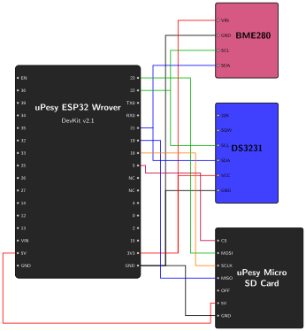

# Real-Time Clock {.unnumbered}
In the previous chapter, we used `millis()` to stamp our sensor readings. While this works to measure time since the ESP32 booted, we need an absolute timestamp (e.g., Year, Month, Day, Hour, Minute, Second) that survives reboots and power losses. This is why we are introducing the DS3231 Real-Time Clock (RTC).

This chapter will cover:

1. Introducing the DS3231 RTC and its features.
2. Connecting the DS3231 RTC to the ESP32.
3. Programming the ESP32 to retrieve the exact time.

## 1. Introducing the DS3231 RTC

The DS3231 is a highly accurate real-time clock. It has a dedicated coin-cell battery, meaning it keeps track of time even when the ESP32 is completely unpowered. 

Besides just keeping time, the DS3231 has some powerful built-in features that we will use later in the project to wake up our ESP32 from deep sleep:
*   **Two Hardware Alarms (Alarm 1 & Alarm 2):** You can program these alarms to trigger at a specific time. When they trigger, the RTC changes the state of a specific pin (the SQW pin).
*   **SQW (Square Wave) Pin:** This pin can either output a continuous oscillating signal, or it can act as an interrupt pin that drops to 0V when an alarm goes off.
*   **32K Pin:** This pin outputs a continuous 32kHz signal, which is useful for some specific electronics but completely unnecessary for our project.

Because the DS3231 has its own battery, its internal settings (like active alarms or the SQW pin state) are permanently saved. If you don't explicitly turn them off in your code, they will stay active forever, even if you upload brand new code to the ESP32! That is why our code will include a "cleanup" step to reset these features.

## 2. The Hardware Connection

The DS3231 communicates using the I2C protocol, just like our BME280 sensor. This is incredibly convenient because we can connect it to the exact same I2C pins (SDA and SCL) on the ESP32!

### Wiring the Components

Since the BME280 is already using the I2C bus, you can simply connect the DS3231 in parallel:

*   **VCC:** Connect to the ESP32 **3V3** pin.
*   **GND:** Connect to an ESP32 **GND** pin.
*   **SDA:** Connect to ESP32 Pin **21** (shared with BME280).
*   **SCL:** Connect to ESP32 Pin **22** (shared with BME280).

{width=500}

## 3. Program the ESP32 to Save Data

### Setup

We will build upon the code from the previous chapter. First, we need to include the necessary library to handle the RTC. We will use the `RTClib` library by Adafruit.

Your `platformio.ini` should now look like this:

```ini
[platformio]
src_dir = .

[env:upesy_wrover]
platform = espressif32
board = upesy_wrover
framework = arduino
monitor_speed = 115200
lib_deps =
    adafruit/Adafruit BME280 Library @ ^2.2.4
    adafruit/RTClib @ ^2.1.4
```

> **Ready-to-use project:** If you don't want to copy-paste, you can directly open the complete PlatformIO project from the source code here: [`03_real_time_clock`](https://github.com/wg1d/personal-autonomous-weather-station/tree/main/firmware/Phase-01/03_real_time_clock)

### The Code

Here is the updated code that reads the RTC, formats an ISO 8601 string, and appends the data to the SD card. We have added some initialization logic to properly clear the RTC alarms, based on the [Adafruit RTClib Alarm Example](https://github.com/adafruit/RTClib/blob/master/examples/DS3231_alarm/DS3231_alarm.ino).

```cpp
/*
 * Project: Personal Autonomous Weather Station
 * Phase 01: Real-Time Clock
 * File: 03_real_time_clock.ino
 * 
 * Description:
 * This sketch initializes the BME280 sensor, DS3231 RTC, and the SD Card.
 * It reads temperature, humidity, pressure, and absolute time.
 * The data is appended to a CSV file every 5 seconds.
 */

#include <Arduino.h>
#include <Adafruit_Sensor.h>
#include <Adafruit_BME280.h>
#include <SPI.h>
#include <SD.h>
#include <FS.h>
#include <RTClib.h>

#define SD_CS_PIN 5
#define SD_OFF_PIN 13

Adafruit_BME280 bme;
RTC_DS3231 rtc;

// Helper function to append a string to a file on the SD card
void appendFile(fs::FS &fs, const char * path, const char * message) {
  File file = fs.open(path, FILE_APPEND);
  if (!file) {
    Serial.println("Failed to open file for appending");
    return;
  }
  if (!file.print(message)) {
    Serial.println("Append failed");
  }
  file.close();
}

void setup() {
  Serial.begin(115200);
  Serial.println("\nInitializing Weather Station...");

  // Initialize the OFF pin to turn on the SD card reader
  pinMode(SD_OFF_PIN, OUTPUT);
  digitalWrite(SD_OFF_PIN, HIGH);
  delay(100);

  // Initialize BME280
  if (!bme.begin(0x76)) {
    Serial.println("Could not find a valid BME280 sensor!");
    while (1) delay(10);
  }

  // Initialize DS3231 RTC
  if (!rtc.begin()) {
    Serial.println("Couldn't find RTC");
    while (1) delay(10);
  }
  
  if (rtc.lostPower()) {
    Serial.println("RTC lost power, let's set the time!");
    // When time needs to be set on a new device, or after a power loss, the
    // following line sets the RTC to the date & time this sketch was compiled
    rtc.adjust(DateTime(F(__DATE__), F(__TIME__)));
  }

  // 1. Disable the 32K output (we don't need it)
  rtc.disable32K();

  // 2. Stop the SQW pin from oscillating 
  // (It must be turned off for the alarms to control this pin later)
  rtc.writeSqwPinMode(DS3231_OFF);

  // 3. Turn off both Alarm 1 and Alarm 2
  // (Settings are kept on battery, so we must explicitly disable them)
  rtc.disableAlarm(1);
  rtc.disableAlarm(2);

  // 4. Clear any existing alarm flags
  // (Ensures the RTC doesn't think an alarm just went off)
  rtc.clearAlarm(1);
  rtc.clearAlarm(2);

  // Initialize SD Card
  if (!SD.begin(SD_CS_PIN)) {
    Serial.println("Card Mount Failed.");
    while (1) delay(10);
  }

  uint8_t cardType = SD.cardType();
  if (cardType == CARD_NONE) {
    Serial.println("No SD card attached");
    while (1) delay(10);
  }

  // Create the CSV file header
  if (!SD.exists("/weather_data.csv")) {
    File file = SD.open("/weather_data.csv", FILE_WRITE);
    if (file) {
      file.println("timestamp;temperature;humidity;pressure");
      file.close();
      Serial.println("Created weather_data.csv with header.");
    }
  }

  // Turn off the SD card module until we need to write
  SD.end();
  digitalWrite(SD_OFF_PIN, LOW);
}

void loop() {
  // Read absolute time from RTC
  DateTime now = rtc.now();
  
  // Read data from BME280
  float temperature = bme.readTemperature();
  float humidity = bme.readHumidity();
  float pressure = bme.readPressure() / 100.0F;

  // Format timestamp (YYYY-MM-DDTHH:MM:SS)
  char timestamp[20];
  sprintf(timestamp, "%04d-%02d-%02dT%02d:%02d:%02d", 
          now.year(), now.month(), now.day(),
          now.hour(), now.minute(), now.second());

  // Print to Serial for debugging
  Serial.println("-------------------------");
  Serial.printf("Time: %s\n", timestamp);
  Serial.printf("Temperature: %.2f *C\n", temperature);
  Serial.printf("Humidity: %.2f %%\n", humidity);
  Serial.printf("Pressure: %.2f hPa\n", pressure);

  // Format the data into a CSV string
  char dataString[100];
  sprintf(dataString, "%s;%.2f;%.2f;%.2f\n", 
          timestamp, temperature, humidity, pressure);

  // Power on the SD card module
  digitalWrite(SD_OFF_PIN, HIGH);
  delay(100);
  
  if (SD.begin(SD_CS_PIN)) {
    appendFile(SD, "/weather_data.csv", dataString);
    Serial.println("Data saved to SD card.");
  } else {
    Serial.println("Failed to mount SD card during write.");
  }

  // Power off the SD card module
  SD.end();
  digitalWrite(SD_OFF_PIN, LOW);

  // Wait for 5 seconds
  delay(5000); 
}
```

### Code Explanation

Here is a breakdown of the new RTC components in the code:

1. **`RTC_DS3231 rtc;`**: Creates an object to interact with the DS3231.
2. **`rtc.begin()`**: Initializes the I2C communication with the RTC. If this fails, the wiring is likely incorrect.
3. **`rtc.lostPower()`**: This is a great feature of the DS3231. If the coin-cell battery was removed or depleted, the RTC "forgets" the time. This function detects that state.
4. **`rtc.adjust(DateTime(F(__DATE__), F(__TIME__)));`**: If power was lost, this sets the RTC to the exact date and time the code was compiled by your computer! Once the time is set, you don't need to run this again unless the battery dies.
5. **RTC Cleanup (`disable32K`, `writeSqwPinMode`, `disableAlarm`, `clearAlarm`)**: Because the DS3231 runs on its own battery, any alarms or pin settings from previous projects will remain active. We explicitly disable the 32K signal, stop the SQW pin from oscillating, and turn off both alarms to ensure the RTC starts in a clean, predictable state for our weather station.
6. **`DateTime now = rtc.now();`**: In the `loop()`, this retrieves the current time from the RTC.
7. **Formatting with `%04d-%02d-%02dT%02d:%02d:%02d`**: This formats the date into the standard ISO 8601 format (e.g., `2026-07-22T14:50:00`), ensuring all timestamps are uniformly zero-padded. The `T` in the middle might look strange, but it acts as a standard separator between the date and the time. We use this format because modern databases and backend servers natively expect it, which will make our data transfer in later phases much easier!

### Expected Output
> Before running this code, it is recommended to delete the existing
> `weather_data.csv` file from your SD card. This prevents mixing the old 
> `millis()` timestamps from the previous chapter with our new absolute RTC 
> timestamps!

Upload the code and open the Serial Monitor.

```text
Initializing Weather Station...
Created weather_data.csv with header.
-------------------------
Time: 2026-07-22T15:34:21
Temperature: 28.43 *C
Humidity: 26.37 %
Pressure: 1000.30 hPa
Data saved to SD card.
-------------------------
Time: 2026-07-22T15:34:26
Temperature: 28.46 *C
Humidity: 26.14 %
Pressure: 1000.29 hPa
Data saved to SD card.
-------------------------
Time: 2026-07-22T15:34:31
Temperature: 28.50 *C
Humidity: 26.09 %
Pressure: 1000.30 hPa
Data saved to SD card.
```

If you pop the SD card out and put it into your computer, you should find a `weather_data.csv` file containing all the saved measurements and it should looked like this:

```csv
timestamp;temperature;humidity;pressure
2026-07-22T15:34:21;28.43;26.37;1000.30
2026-07-22T15:34:26;28.46;26.14;1000.29
2026-07-22T15:34:31;28.50;26.09;1000.30
```

Now that we have accurate timestamps and reliable data storage, our basic weather station is complete! However, if you tried to run this on a battery right now, it would drain very quickly. In the next phase, we will introduce Deep Sleep mode and use the RTC alarms we configured earlier to drastically reduce power consumption.
