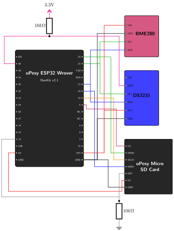

# Hardware Modifications {.unnumbered}

To implement deep sleep and power cycle our components, we need to make two crucial additions to the Phase 01 design.

## SD Card OFF Pin (Power Cycling)

As discussed in Phase 01, SD cards can be power-hungry. During active reading or writing, the module draws **< 30mA** (depending on the specific microSD card used). The uPesy Micro SD card reader is quite efficient when idle (SPI communication inactive), dropping to around **150µA**. However, over months of deployment, this continuous 150µA draw still adds up and affects our long-term battery life.

To optimize this, we will connect the SD card reader's **OFF** pin.

*   By pulling this pin `HIGH` (3.3V), the module turns on.
*   By pulling this pin `LOW` (0V), the module cuts power to the SD card, dropping its current consumption from 150µA to approximately **1µA**.

We will connect the **OFF** pin to **ESP32 GPIO 13** and place a **10kΩ pull-down resistor** between the OFF pin and GND.

> **Why do we need a pull-down resistor? (Floating Pins)**
> When the ESP32 enters deep sleep, its standard GPIO pins lose their state and become "high impedance" (they stop outputting any voltage). If a pin is not connected to a defined voltage, it acts like an antenna and "floats"—meaning ambient electromagnetic noise can cause the voltage to randomly jump between HIGH and LOW. 
> 
> If the SD card's `OFF` pin floats, the SD card module could randomly turn itself on and off while the ESP32 is asleep, draining the battery! The 10kΩ pull-down resistor acts as an anchor, firmly tying the `OFF` pin to 0V (LOW) when the ESP32 goes to sleep, ensuring the SD card stays completely off.

### Choosing the Resistor Value ($R_{min}$ and $R_{max}$)

Why use a **$10k\Omega$** resistor specifically? The choice is a balance between **signal stability** and **power consumption**:

*   **$R_{min}$ (Too small):** Constrained by the ESP32's maximum GPIO output current. You can compute this by checking the **Absolute Maximum Ratings** in the datasheet for the maximum current a pin can source ($I_{max}$), and applying Ohm's Law ($R = V / I_{max}$). If your resistor is smaller than this limit, you will damage the chip. Even if you use a safe but small value (like $1k\Omega$), it will leak $3.3mA$ when driven HIGH, wasting massive battery power.
*   **$R_{max}$ (Too large):** Constrained by the **Input Leakage Current** of the receiving pin (found in the **DC Characteristics** of the datasheet). No pin is a perfect insulator. To keep the pin safely recognized as a logic `LOW`, the resistor must be strong enough to overcome this leakage without letting the voltage rise above the `LOW` logic threshold (e.g., $0.5V$). If the resistor is too large, the pin will float.

## DS3231 SQW Pin (Wake-up Interrupt)

To wake the ESP32 up from deep sleep, we will use the DS3231's internal hardware alarms. When an alarm triggers, the RTC pulls its **SQW** (Square Wave) pin LOW. 

We need to connect this SQW pin to an "RTC GPIO" on the ESP32. Only specific pins (RTC GPIOs) are capable of listening for signals while the rest of the ESP32 is asleep (EXT0 wake-up). 

We will connect the **SQW** pin to **ESP32 GPIO 36** . 
Because the SQW pin is an open-drain output, it requires a **pull-up resistor** to keep the voltage HIGH (3.3V) until the alarm actively pulls it LOW. We will connect a **10kΩ pull-up resistor** between the SQW pin and the 3.3V power rail.

> **Note on Pull-up Resistor Value**
> The logic here is identical to our pull-down resistor. When the RTC alarm triggers, it connects the `SQW` pin to ground (0V). The pull-up resistor sits between 3.3V and 0V during the alarm event. Using a $10k\Omega$ resistor limits the wasted current during the alarm trigger to just $0.33mA$ ($I = \frac{3.3V}{10,000\Omega}$), while being strong enough to keep the pin at a stable 3.3V when the alarm is inactive.

## Updated Wiring Diagram

Here is the updated circuit incorporating these two power management modifications:

{width=600}

### Wiring Summary

*   **ESP32 Pin 13** ➔ **SD Card OFF** (with a 10kΩ pull-down resistor to GND)
*   **ESP32 Pin 36 (VP)** ➔ **DS3231 SQW** (with a 10kΩ pull-up resistor to 3.3V)

With the hardware ready, let's move on to writing the firmware that actually utilizes these new connections!
