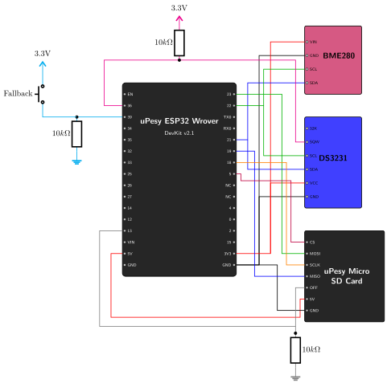
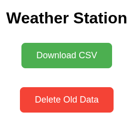

# Fallback Access Point & Web Server {.unnumbered}

If you deploy your autonomous weather station in the middle of a forest—or simply change your home Wi-Fi password—the station won't be able to connect to the internet. If it can't connect, how do you retrieve the data saved on the SD card without disassembling the waterproof enclosure?

We solve this by implementing a **Fallback Access Point**. If we press a physical button on the outside of the enclosure, the ESP32 will wake up and instantly broadcast its own Wi-Fi network (Access Point). We can then connect to it with our phone and download the CSV data directly from a built-in web server!

## The Hardware: The Fallback Button

{width=600}

To trigger this mode, we wire a physical push-button to **Pin 39** (an RTC pin capable of waking the ESP32 from deep sleep). But we can't just wire the button directly to the pin, we must use a **Pull-down Resistor**.

### Pull-Up vs. Pull-Down Resistors
Microcontroller pins are incredibly sensitive. If a pin is not connected to anything (known as "floating"), it will pick up electromagnetic noise from the air and randomly flip between `HIGH` (1) and `LOW` (0). 

To give the pin a stable, default state when the button is not pressed, we use a resistor:

- **Pull-up Resistor:** Connects the pin to `3.3V`. The default state is `HIGH`. When you press the button, it connects the pin to `GND`, driving it `LOW`.
- **Pull-down Resistor:** Connects the pin to `GND`. The default state is `LOW`. When you press the button, it connects the pin to `3.3V`, driving it `HIGH`.

### Why Deep Sleep Requires a Pull-Down
During Deep Sleep, we want the system to draw absolute minimum power.
We will configure the ESP32 to wake up using `ESP_EXT1_WAKEUP_ANY_HIGH` (wake when the pin goes HIGH). 
By using a **Pull-down resistor** (connected to GND), the pin defaults to 0V when the button is unpressed. Because there is no voltage difference, **absolutely zero current flows through the resistor** while the station is sleeping!

If we used a Pull-up resistor (connected to 3.3V), we would have to configure the ESP32 to wake up when the pin goes LOW. But wait! The DS3231 RTC alarm pin already uses the `EXT0` wakeup (which wakes on LOW). To avoid conflicting wakeup logic and keep things clean, we dedicate `EXT1` to waking up on HIGH for the manual button.

### Sizing the Resistor (Ohm's Law)
When you *press* the button, electricity flows from `3.3V`, through the button, and splits: some goes into the ESP32 pin, and the rest flows through our Pull-down resistor straight to `GND`.

We use **Ohm's Law ($V = I \times R$)** to determine the right resistor size:

- **Minimum Resistance:** If you use a very small resistor (e.g., 100Ω), the current would be $I = 3.3V / 100Ω = 33mA$. This is a massive current draw just for pressing a button, and if you accidentally used 0Ω (no resistor), you would create a short-circuit and instantly destroy the ESP32's power regulator!
- **Maximum Resistance:** If you use a massive resistor (e.g., 10MΩ), it is so resistant that it can't effectively ground the electromagnetic noise from the air, causing the pin to "float" and trigger false wakeups.

**The Sweet Spot:** A **10kΩ resistor** is the industry standard. When you press the button, it draws a microscopic $I = 3.3V / 10kΩ = 0.33mA$. It is perfectly safe, wastes almost no battery, and is strong enough to keep the pin completely stable!

## The Code

> **Ready-to-use project:** The complete code for this dual-boot firmware is available in the repository here: [`07_wifi_fallback_ap`](https://github.com/wg1d/personal-autonomous-weather-station/tree/main/firmware/Phase-03/07_wifi_fallback_ap)

> **Further Reading:** For a deeper dive into the specific Wi-Fi methods used below, you can refer to this excellent [uPesy tutorial on creating a Wi-Fi Access Point with an ESP32](https://www.upesy.fr/blogs/tutorials/how-create-a-wifi-acces-point-with-esp32).

When the ESP32 wakes up, we immediately check the reason. If it was woken by our Pin 39 button (`ESP_SLEEP_WAKEUP_EXT1`), we skip the sensor reading and instantly launch an Access Point named **WeatherStation_AP**:

```cpp
esp_sleep_wakeup_cause_t wakeup_reason = esp_sleep_get_wakeup_cause();
  
if (wakeup_reason == ESP_SLEEP_WAKEUP_EXT1) {
  Serial.println("Wakeup by Fallback Button! Starting AP Mode...");
  
  // Power on SD Card
  pinMode(SD_OFF_PIN, OUTPUT);
  digitalWrite(SD_OFF_PIN, LOW);
  delay(500);
  SD.begin(SD_CS_PIN);
  
  // Start Wi-Fi Access Point
  WiFi.softAP("WeatherStation_AP", "12345678");
```

### Hosting the Web Server
We use the extremely fast and lightweight `ESPAsyncWebServer` library to host a mini-website directly from the ESP32. 

> **Library Fork Notice:** Most older tutorials use the original `me-no-dev/ESPAsyncWebServer` library. However, that repository has been abandoned and throws severe compiler errors on modern ESP32 cores. We are using the actively maintained community fork by `mathieucarbou` (as defined in our `platformio.ini`), which serves as a flawless, modern drop-in replacement.

We define three routes:
1. `GET /` : Serves a beautiful HTML interface with a green "Download" button and a red "Delete" button.
2. `GET /download` : Immediately downloads `weather_data.csv` from the SD card to the user's phone.
3. `POST /delete` : Deletes the CSV file from the SD card to free up space.

```cpp
server.on("/", HTTP_GET, [](AsyncWebServerRequest *request){
  String html = "<html>...<button class='btn-down'>Download CSV</button>...</html>";
  request->send(200, "text/html", html);
});

server.on("/download", HTTP_GET, [](AsyncWebServerRequest *request){
  request->send(SD, "/weather_data.csv", "text/csv", true);
});

server.on("/delete", HTTP_POST, [](AsyncWebServerRequest *request){
  SD.remove("/weather_data.csv");
  request->send(200, "text/html", "<html>...<h2>Data Deleted!</h2>...</html>");
});

server.begin();
```

### The 3-Minute Timeout
If we forget to turn the AP off, it would drain the entire battery in hours. In our `loop()` function, we implement a simple non-blocking 3-minute timer. Once the time expires, we shut down the Wi-Fi radio, power off the SD card, re-arm the wakeups, and go back to deep sleep!

```cpp
void loop() {
  esp_sleep_wakeup_cause_t wakeup_reason = esp_sleep_get_wakeup_cause();
  if (wakeup_reason == ESP_SLEEP_WAKEUP_EXT1) {
    // AP Mode Timeout Logic (3 Minutes)
    static unsigned long apStartTime = millis();
    if (millis() - apStartTime > 180000) {
      Serial.println("\nAP Timeout reached. Shutting down...");
      WiFi.softAPdisconnect(true);
      WiFi.mode(WIFI_OFF);
      
      // Re-arm wakeups and sleep
      esp_sleep_enable_ext0_wakeup((gpio_num_t)RTC_WAKEUP_PIN, 0);
      esp_sleep_enable_ext1_wakeup(1ULL << FALLBACK_BUTTON_PIN, ESP_EXT1_WAKEUP_ANY_HIGH);
      esp_deep_sleep_start();
    }
  }
}
```

### What if a sensor reading is scheduled during AP Mode?
You might wonder: what happens if the DS3231 RTC triggers an alarm (pulling Pin 36 `LOW`) while you are currently downloading data via the Access Point? Will the ESP32 crash, or will the alarm be missed forever?

Because the ESP32 is fully awake serving the web page, it completely ignores the `EXT0` deep-sleep wakeup signal. This allows your web session to continue uninterrupted. However, the DS3231's alarm doesn't just pulse; it **latches**. The DS3231 stubbornly holds Pin 36 at `LOW` indefinitely until the microcontroller explicitly clears the alarm flag over I2C.

The moment your 3-minute AP session expires and the ESP32 enters deep sleep, the hardware instantly detects that Pin 36 is *already* `LOW`. It instantly wakes back up via `EXT0`, executes the standard sensor loop, clears the alarm, takes the missed reading, and uploads it! It is a brilliant, zero-code queuing system built right into the hardware architecture.

> **Why don't we reprogram the clock before sleeping?** 
> Notice that in the AP Mode code, we do *not* tell the RTC to set a new alarm before going back to sleep. This is deliberate! The DS3231 is completely independent. If the alarm hasn't fired yet, leaving it alone ensures the next reading happens perfectly on the original grid schedule. If we reprogrammed it, we would ruin the hourly alignment!

## Running the Test
1. Compile and upload `07_wifi_fallback_ap` to your ESP32.
2. The ESP32 will go to sleep. **Do not wait for the RTC timer.** Instead, simply **press the physical button** you just wired to Pin 39.
3. Open your smartphone's Wi-Fi settings and connect to `WeatherStation_AP` (Password: `12345678`).
4. Open your web browser and navigate to `http://192.168.4.1` (the default ESP32 AP IP address).
5. You should see our sleek interface! Click **Download** to grab your data, or **Delete** to wipe the SD card!
6. Wait 3 minutes, and watch the Serial Monitor as the ESP32 automatically shuts down the AP and returns to Deep Sleep.

### Expected Output

If everything is wired and coded correctly, your Serial Monitor should show a beautiful sequence of events: a standard reading, a fallback AP session, and a "catch-up" reading that perfectly re-aligns to the 30-second grid!

```text
--- Waking up from Deep Sleep ---
Standard Wakeup (RTC Timer). Taking reading...
Data: 2026-07-24T15:58:30;30.15;31.03;991.36
Data saved to SD card.
Connecting to WiFi.....
Connected to WiFi network
Uploading CSV file to server: http://192.168.1.15:5000/upload
HTTP Response code: 200
Next reading scheduled for: 15:59:00
Entering Deep Sleep...
ets Jun  8 2016 00:22:57

... [User presses the button] ...

--- Waking up from Deep Sleep ---
Wakeup by Fallback Button! Starting AP Mode...
AP IP address: 192.168.4.1
Web server started.
AP Mode shutting down in 170 seconds...
User is downloading weather_data.csv...
AP Mode shutting down in 160 seconds...
User deleted weather_data.csv!
AP Mode shutting down in 150 seconds...
...
AP Timeout reached. Shutting down...
Entering Deep Sleep...
ets Jun  8 2016 00:22:57

... [ESP32 instantly wakes up because RTC alarm triggered during AP Mode] ...

--- Waking up from Deep Sleep ---
Standard Wakeup (RTC Timer). Taking reading...
Data: 2026-07-24T16:01:53;30.56;30.51;991.27
Data saved to SD card.
Connecting to WiFi....
Connected to WiFi network
Uploading CSV file to server: http://192.168.1.15:5000/upload
HTTP Response code: 200
Next reading scheduled for: 16:02:00
Entering Deep Sleep...
```

And here is what the sleek web interface looks like on your device:

{width=200}

## Next Steps
Our weather station is now incredibly robust! We have standard uploads and a foolproof manual fallback mechanism. However, since we're already connecting to Wi-Fi to upload data, we have an amazing opportunity to perform some self-healing. Let's move on to the **Bonus Chapter: NTP Time Synchronization**, where we'll teach the ESP32 to automatically calibrate the DS3231's atomic clock!
