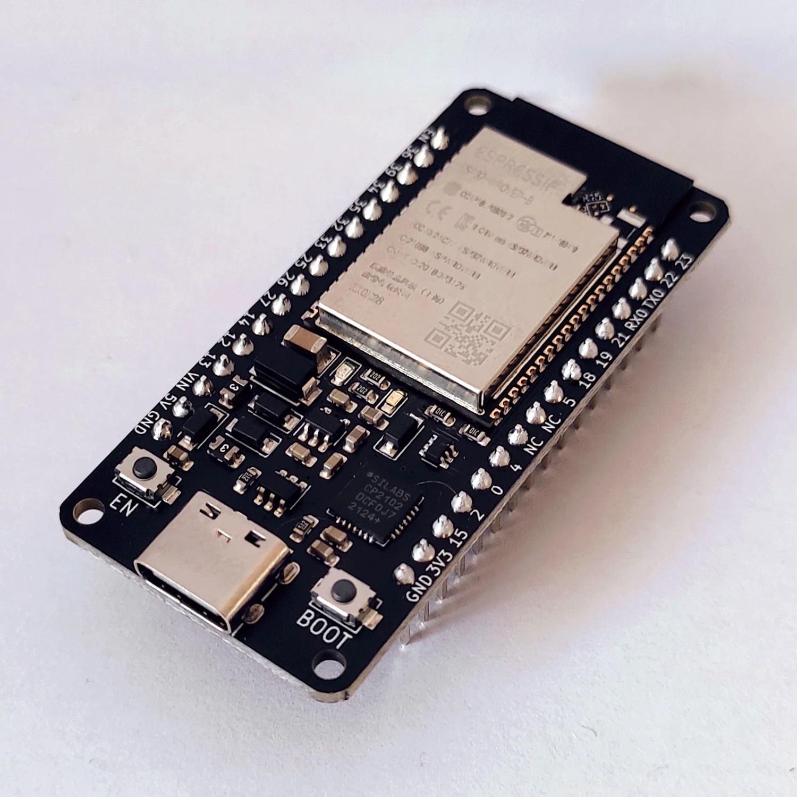
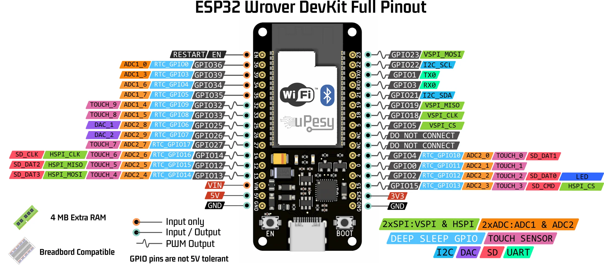
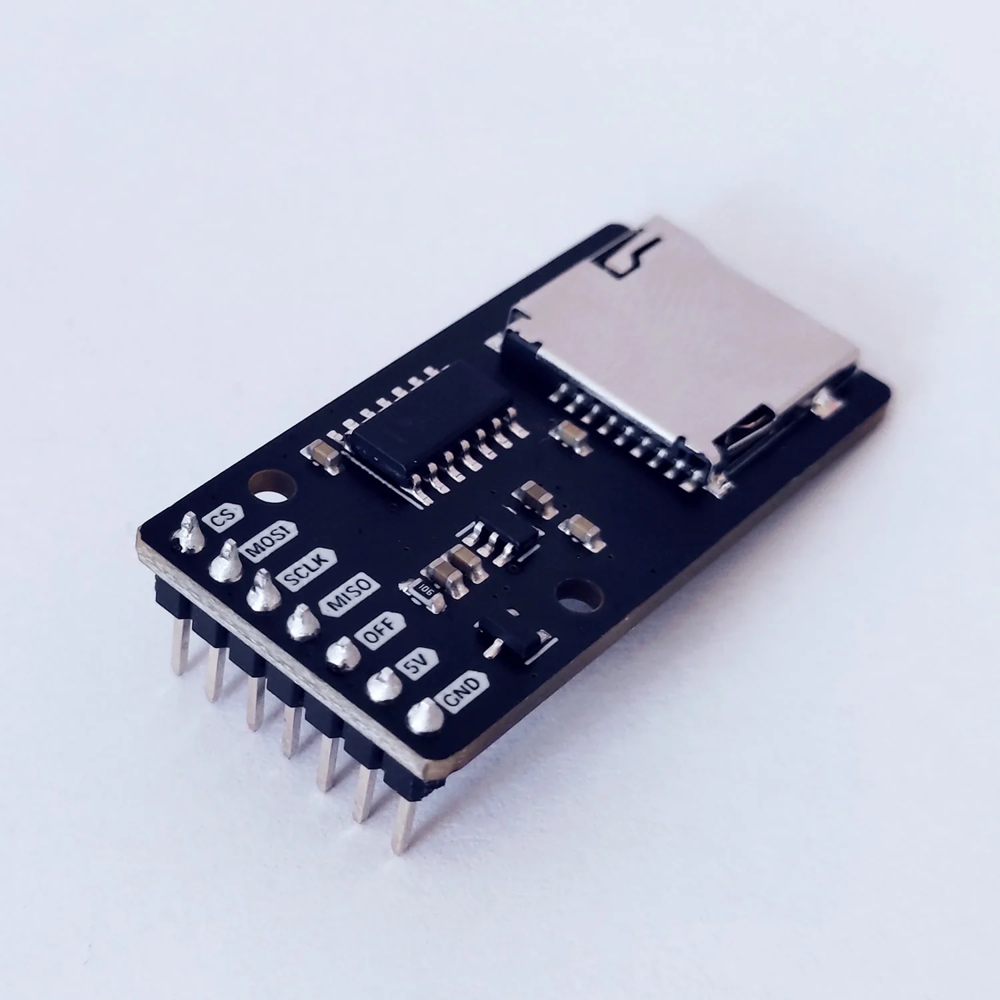
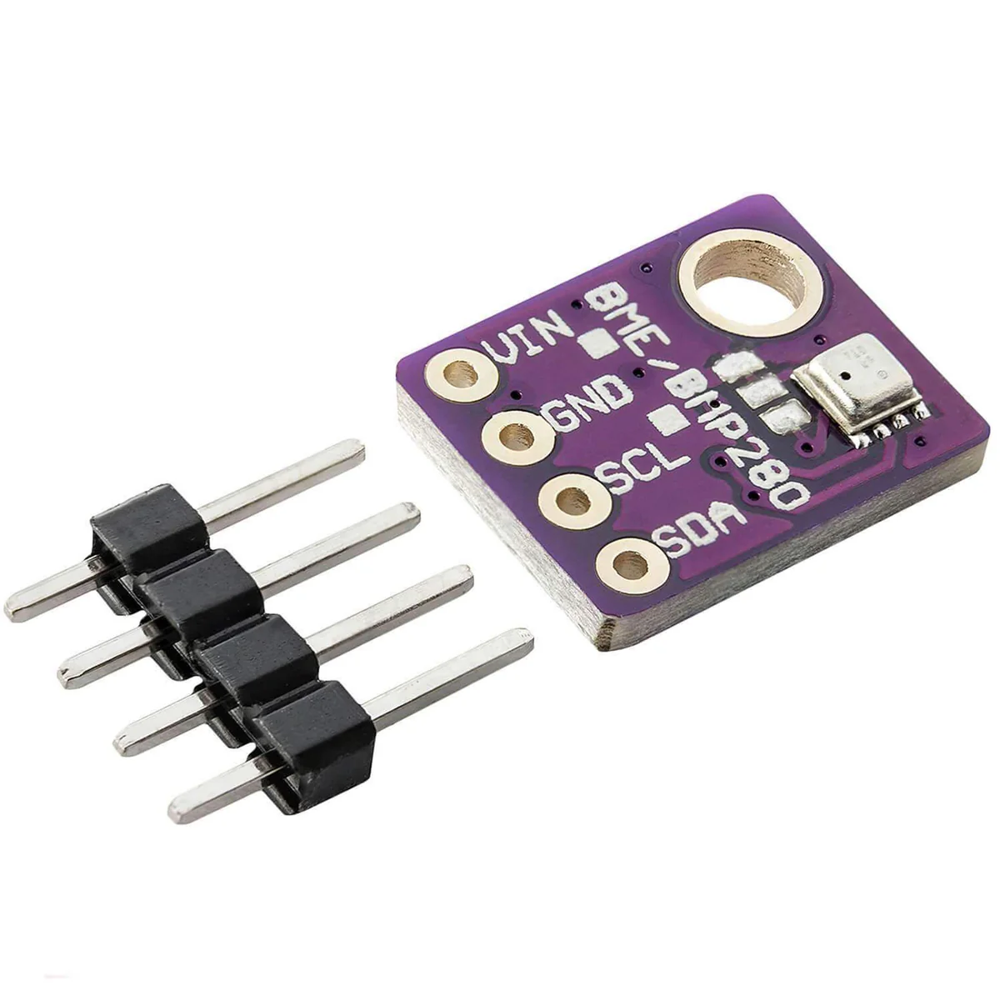
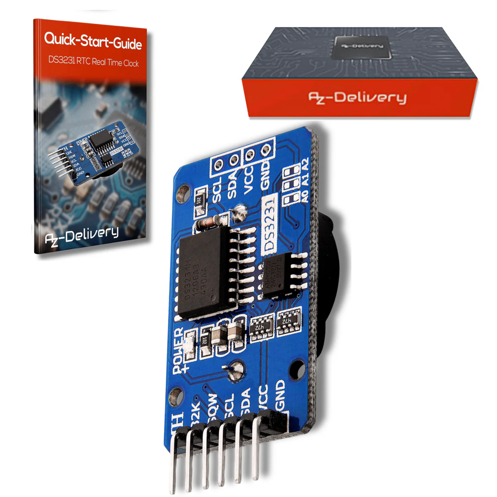

# Required components {.unnumbered}
In order to start building our prototype, we need to gather the following components:

## Hardware

| Component | Value | Purpose | Link | Datasheet |
|-----------|-------|---------|------|-----------|
| Microcontroller | uPesy ESP32 Wrover DevKit v2.1 | Main processor and Wi-Fi controller | [Link](https://www.upesy.fr/products/upesy-esp32-wrover-devkit-board) | [ESP32](https://documentation.espressif.com/esp32_datasheet_en.pdf), [ESP32-WROVER-E module](https://documentation.espressif.com/esp32-wrover-e_esp32-wrover-ie_datasheet_en.pdf) |
| Real-Time Clock | DS3231 | Provides accurate timekeeping (even when powered off) | [Link](https://www.az-delivery.de/fr/products/real-time-clock-kostenfreies-e-book) | [DS3231](https://www.analog.com/media/en/technical-documentation/data-sheets/DS3231.pdf) |
| Micro SD Card Module | uPesy Micro SD card reader | Local data storage | [Link](https://www.upesy.fr/products/upesy-micro-sd-card-reader-module) | No datasheet: [uPesy documentation](https://www.upesy.fr/blogs/tutorials/upesy-microsd-module-quickstart-guide) |
| Temp/Humidity/Pressure | BME280 | Measures temperature, humidity, and pressure | [Link](https://www.az-delivery.de/fr/products/gy-bme280) | [BME280](https://www.bosch-sensortec.com/media/boschsensortec/downloads/datasheets/bst-bme280-ds002.pdf) |

The datasheets are the reference for every electrical value used in this book (currents, voltages, accuracies). The module boards (ESP32 DevKit, DS3231 and BME280 breakouts) add their own components, such as regulators, LEDs and resistors, which are not covered by the chip datasheets.

In addition, we will need a breadboard, some jumper wires, a push button, some resistors, a micro SD card, and a USB cable to program and power the ESP32.

### Why use an ESP32?
The main reason is that it is very well known in the open-source community, meaning there is a wealth of information and libraries available for it. It also has built-in Wi-Fi and Bluetooth, along with a deep-sleep mode, which is essential for a battery or solar-powered weather station.

However, feel free to use any other microcontroller that you are more familiar with. The code is written using the Arduino framework, which is compatible with many microcontrollers, making it relatively easy to switch to another board. The main hardware requirements are that the microcontroller must have deep-sleep capabilities, I2C and SPI interfaces, and at least two deep-sleep wake-up sources (e.g., a timer and an external pin). It is also assumed that your chosen microcontroller has enough digital and analog GPIO pins to connect all the required sensors.

### Why use the uPesy ESP32 Wrover DevKit v2.1?
This specific board was chosen for several practical reasons:

- **Breadboard Friendly**: It is 100% compatible with a standard breadboard, leaving pins accessible on both sides.
- **Convenience**: It features a modern USB-C connector.
- **High Performance**: It includes 4MB of PSRAM and 16MB of Flash memory.
- **Clear Pinout**: It only exposes truly usable pins, avoiding common ESP32 strapping pin pitfalls that often catch beginners.

{width=200}

The full pin configuration is shown here and additional information can be found [here](https://www.upesy.com/blogs/tutorials/esp32-quickstart-installation-programming-guide).

{width=800}

### Why use the uPesy Micro SD card reader module?
We use this specific module because:

- **Energy Efficient**: It can be powered off completely via a dedicated control pin, which is a critical feature for our future battery-powered data logger.

{width=200}

### Why start with the BME280?
It is a small, affordable sensor that measures temperature (±1 °C), humidity (±3 %RH) and atmospheric pressure (±1 hPa) in one package, according to its datasheet. It is well documented, supported by mature libraries, and a good fit for a first weather station.

{width=200}

### Why use an external Real-Time Clock (RTC)?
The ESP32 has an internal RTC, but its default clock source (an internal RC oscillator) can drift by several percent, especially with temperature changes. The DS3231 is a temperature-compensated RTC with a coin-cell backup: its datasheet specifies ±2 ppm between 0 °C and 40 °C, which is about one minute per year. It keeps time even when the ESP32 is in deep sleep or completely unpowered, so every logged measurement gets a reliable timestamp.

{width=200}

## Software

In order to program the ESP32, we will use VS Code as our primary environment, along with the PlatformIO extension to handle the Arduino framework.

| Software | Purpose |
|----------|---------|
| VS Code | Programming environment |
| PlatformIO extension for VS Code | Arduino programming environment |

All the code and PlatformIO projects will be available on [GitHub](https://github.com/wg1d/personal-autonomous-weather-station).

### Why use VS Code and PlatformIO?
Using VS Code with the PlatformIO extension provides a much richer development experience than the standard Arduino IDE. However, feel free to use the Arduino IDE if you prefer, it is purely a personal choice.

Now that we have listed all the needed materials, let's start by assembling everything on a breadboard.