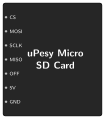
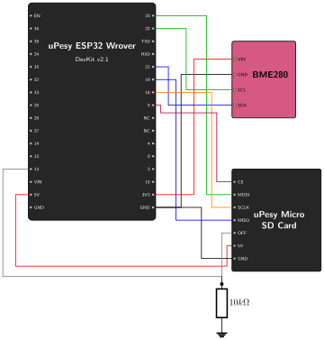

# Data Storage {.unnumbered}
Now that we are successfully acquiring data from the environment, we need to save it so it isn't lost when the ESP32 goes to sleep or loses power. 

This step will cover:

1. Connecting the micro SD card reader to the ESP32.
2. Programming the ESP32 to write our sensor data to the SD card.

## Connect the SD Card Reader to the ESP32

### The SPI Interface

The uPesy Micro SD card reader uses the **SPI** (Serial Peripheral Interface) protocol to communicate with the ESP32. 

Unlike I2C which uses only two wires, SPI is much faster but requires four wires to operate:

*   **MISO (Master In Slave Out):** Data from the SD card to the ESP32.
*   **MOSI (Master Out Slave In):** Data from the ESP32 to the SD card.
*   **SCLK (Serial Clock):** Synchronizes the data transfer.
*   **CS (Chip Select):** Used to select which SPI device to talk to.

### Pinout

The uPesy Micro SD card reader has the following pins:

*   **CS:** Chip Select, used by SPI to activate the module.
*   **SCLK:** Serial Clock, used by SPI for synchronization.
*   **MOSI:** Master Out Slave In, used by SPI to send data to the SD card.
*   **MISO:** Master In Slave Out, used by SPI to receive data from the SD card.
*   **VCC:** Power supply input (5V, internally regulated to 3.3V).
*   **GND:** Ground connection.
*   **OFF:** Unique to this module, used to cut power to the SD card when pulled LOW (we will leave it unconnected for now so it defaults to ON).

{width=150}


> **Documentation Note (EN vs OFF pin)**
> Depending on the version of the uPesy documentation you read, this pin might be labeled as **EN** instead of **OFF**, with conflicting behavior described (e.g., turning off when HIGH instead of LOW). The current French documentation states it is the **OFF** pin, which turns the module ON at 3.3V/5V and OFF at 0V. Regardless of the version, leaving it unconnected allows the module to safely default to ON.


### Wiring the Components

The ESP32 has default pins for SPI communication. Since we are building upon the data acquisition setup from the previous step, we will keep the BME280 sensor connected exactly as it was, and simply add the SD card module to the circuit as follows:

*   **VCC:** Connect to the ESP32 **5V** pin (the module regulates it down to 3.3V).
*   **GND:** Connect to an ESP32 **GND** pin.
*   **MISO:** Connect to ESP32 Pin **19**.
*   **MOSI:** Connect to ESP32 Pin **23**.
*   **SCLK:** Connect to ESP32 Pin **18**.
*   **CS:** Connect to ESP32 Pin **5** (can be changed).

{width=500}

## Program the ESP32 to Save Data

### Setup

We will build upon the code from the previous step. First, we need to include the necessary libraries to handle the SD card and the SPI communication. 

The `SD` and `SPI` libraries are built into the Arduino core for the ESP32, so you don't need to add any new dependencies to your `platformio.ini`. It should look like this:

```{.ini include="../../../../firmware/PoC/Phase-01/02_data_storage/platformio.ini"}
```

> **Ready-to-use project:** The complete code for this data storage phase is available in the repository here: [`02_data_storage`](https://github.com/wg1d/personal-autonomous-weather-station/tree/main/firmware/PoC/Phase-01/02_data_storage)

> **Official uPesy Tutorial:** For a more comprehensive example showcasing the micro SD card reader module, you can refer to the [official uPesy MicroSD Quickstart Guide](https://www.upesy.fr/blogs/tutorials/upesy-microsd-module-quickstart-guide#e1e5dd1f4b6ebf1c1249330e08a6).

### The Code

Here is the updated code that reads the sensor and appends the data to a file on the SD card:

```{.cpp include="../../../../firmware/PoC/Phase-01/02_data_storage/02_data_storage.ino"}
```

### Code Explanation

Here is a breakdown of what the code does:

1. **`SD.begin(SD_CS_PIN)`**: Initializes communication with the SD card using the standard SPI pins, but specifying our custom Chip Select (CS) pin (Pin 5).
2. **`appendFile(...)`**: A helper function that opens the file in `FILE_APPEND` mode. This ensures that new data is added to the end of the file without overwriting previous measurements.

### Expected Output

Upload the code and open the Serial Monitor. You should see the sensor readings just like before, but with the addition of SD card operations:

```text
Initializing Weather Station...
Created weather_data.csv with header.
-------------------------
Temperature: 28.70 *C
Humidity: 25.73 %
Pressure: 1000.83 hPa
Data saved to SD card.
-------------------------
Temperature: 28.71 *C
Humidity: 25.75 %
Pressure: 1000.86 hPa
Data saved to SD card.
```

If you pop the SD card out and put it into your computer, you should find a `weather_data.csv` file containing all the saved measurements and it should look like this:

```csv
timestamp,temperature,humidity,pressure
756,28.70,25.73,1000.83
5907,28.71,25.75,1000.86
```

### Troubleshooting

- **`Card Mount Failed`**: the SD card must be formatted as **FAT32** (cards larger than 32 GB are usually formatted as exFAT out of the box and must be reformatted). Also check that CS is on pin 5 and that the module is powered from **5V**.
- **The file is empty or truncated on the computer**: always remove the card while the ESP32 is not writing (e.g. unplug the ESP32 first). The `close()` call at the end of `appendFile()` is what actually writes the data to the card.

## Next Steps

With data acquisition and persistent storage in place, we have a working baseline. However, our timestamps are only the number of milliseconds since the device booted. In the next step, we add a Real-Time Clock (RTC) to get real date and time timestamps.
