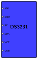
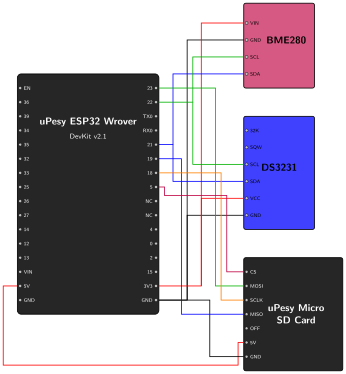

# Real-Time Clock {.unnumbered}
In the previous step, we used `millis()` to stamp our sensor readings. While this works to measure time since the ESP32 booted, we need an absolute timestamp (e.g., Year, Month, Day, Hour, Minute, Second) that survives reboots and power losses. This is why we are introducing the DS3231 Real-Time Clock (RTC).

This step will cover:

1. Introducing the DS3231 RTC and its features.
2. Connecting the DS3231 RTC to the ESP32.
3. Programming the ESP32 to retrieve the exact time.

## Introducing the DS3231 RTC

The DS3231 is a highly accurate real-time clock. It has a dedicated coin-cell battery, meaning it keeps track of time even when the ESP32 is completely unpowered. 

Besides just keeping time, the DS3231 has some powerful built-in features that we will use later in the project to wake up our ESP32 from deep sleep:

*   **Two Hardware Alarms (Alarm 1 & Alarm 2):** You can program these alarms to trigger at a specific time. When they trigger, the RTC changes the state of a specific pin (the SQW pin).
*   **SQW (Square Wave) Pin:** This pin can either output a continuous oscillating signal, or act as an interrupt pin that is pulled to 0V when an alarm goes off. It is an *open-drain* output: it can only pull the line LOW, so it needs a pull-up resistor to go back HIGH (we will add one in Phase 2).
*   **32K Pin:** This pin outputs a continuous 32 kHz signal. It is useful as a clock source for other electronics, but we do not need it.

Because the DS3231 has its own battery, its internal settings (like active alarms or the SQW pin mode) are kept as long as the coin cell lasts. If you don't explicitly turn them off in your code, they stay active, even after you upload new code to the ESP32. That is why our code includes a "cleanup" step to reset these features.

### Pinout

In addition to the 32K and SQW pins described above, the DS3231 uses the following standard I2C and power pins:

*   **SCL:** Serial Clock for I2C communication.
*   **SDA:** Serial Data for I2C communication.
*   **VCC:** Power supply input (typically 3.3V).
*   **GND:** Ground connection.

{width=150}

## The Hardware Connection

The DS3231 communicates using the I2C protocol, just like our BME280 sensor. This is convenient: several devices can share the same I2C bus, so we connect it to the same SDA and SCL pins on the ESP32.

### Wiring the Components

Since the BME280 is already using the I2C bus, you can simply connect the DS3231 in parallel:

*   **VCC:** Connect to the ESP32 **3V3** pin.
*   **GND:** Connect to an ESP32 **GND** pin.
*   **SDA:** Connect to ESP32 Pin **21** (shared with BME280).
*   **SCL:** Connect to ESP32 Pin **22** (shared with BME280).

{width=500}

## Program the ESP32 to Read the Time

### Setup

We will build upon the code from the previous step. First, we need to include the necessary library to handle the RTC. We will use the `RTClib` library by Adafruit.

Your `platformio.ini` should now look like this:

```{.ini include="../../../../firmware/PoC/Phase-01/03_real_time_clock/platformio.ini"}
```

> **Ready-to-use project:** The complete code for this RTC phase is available in the repository here: [`03_real_time_clock`](https://github.com/wg1d/personal-autonomous-weather-station/tree/main/firmware/PoC/Phase-01/03_real_time_clock)

> **Library Reference:** We use the [RTClib](https://github.com/adafruit/RTClib) by Adafruit. We have added some initialization logic to properly clear the RTC alarms, based on the [Adafruit RTClib Alarm Example](https://github.com/adafruit/RTClib/blob/master/examples/DS3231_alarm/DS3231_alarm.ino).

### The Code

```{.cpp include="../../../../firmware/PoC/Phase-01/03_real_time_clock/03_real_time_clock.ino"}
```

### Code Explanation

Here is a breakdown of the new RTC components in the code:

1. **`RTC_DS3231 rtc;`**: Creates an object to interact with the DS3231.
2. **`rtc.begin()`**: Initializes the I2C communication with the RTC. If this fails, the wiring is likely incorrect.
3. **`rtc.lostPower()`**: If the coin-cell battery was removed or depleted, the RTC "forgets" the time. The DS3231 records this in its *Oscillator Stop Flag*, and this function reads it.
4. **`rtc.adjust(compileTime - TimeSpan(COMPILE_TIME_UTC_OFFSET))`**: If power was lost, this sets the RTC to the date and time the code was compiled by your computer (a few seconds before the upload, which is accurate enough for now; Phase 3 adds NTP synchronization). Once the time is set, you don't need to run this again unless the battery dies.

::: {.callout-important}
## Store time in UTC

`__DATE__` and `__TIME__` are in your computer's **local time**. We store every timestamp in **UTC** instead: it has no daylight saving jumps (no duplicated or missing hour twice a year), and it is what NTP returns in Phase 3. Set `COMPILE_TIME_UTC_OFFSET` to your offset from UTC, in seconds (e.g. `3600` for Paris in winter, `7200` in summer). Conversion to local time is the job of the dashboard, not of the station.

If your RTC was already set in local time by an earlier sketch, `lostPower()` returns `false` and the time is not updated. Remove the coin cell for a few seconds to reset it, then upload the sketch again.
:::
5. **RTC Cleanup (`disable32K`, `writeSqwPinMode`, `disableAlarm`, `clearAlarm`)**: Because the DS3231 runs on its own battery, any alarms or pin settings from previous projects will remain active. We explicitly disable the 32K signal, stop the SQW pin from oscillating, and turn off both alarms to ensure the RTC starts in a clean, predictable state for our weather station.
6. **`DateTime now = rtc.now();`**: In the `loop()`, this retrieves the current time from the RTC.
7. **Formatting with `%04d-%02d-%02dT%02d:%02d:%02d`**: This formats the date in the ISO 8601 format (e.g., `2026-07-22T14:50:00`), with every field zero-padded. The `T` is the standard separator between the date and the time. Databases and backend frameworks parse this format natively, which simplifies data transfer in later phases.

### Expected Output
> Before running this code, delete the existing `weather_data.csv` file
> from your SD card. This prevents mixing the `millis()` timestamps of the
> previous step with the new absolute RTC timestamps.

Upload the code and open the Serial Monitor.

```text
Initializing Weather Station...
Created weather_data.csv with header.
-------------------------
Time: 2026-07-22T15:34:21
Temperature: 28.43 *C
Humidity: 26.37 %
Pressure: 1000.30 hPa
Data saved to SD card.
-------------------------
Time: 2026-07-22T15:34:26
Temperature: 28.46 *C
Humidity: 26.14 %
Pressure: 1000.29 hPa
Data saved to SD card.
-------------------------
Time: 2026-07-22T15:34:31
Temperature: 28.50 *C
Humidity: 26.09 %
Pressure: 1000.30 hPa
Data saved to SD card.
```

If you pop the SD card out and put it into your computer, you should find a `weather_data.csv` file containing all the saved measurements and it should look like this:

```csv
timestamp,temperature,humidity,pressure
2026-07-22T15:34:21,28.43,26.37,1000.30
2026-07-22T15:34:26,28.46,26.14,1000.29
2026-07-22T15:34:31,28.50,26.09,1000.30
```

## Next Steps

With accurate timestamps and local storage, the basic data logger is complete. However, it stays awake all the time, so a battery would be drained within a day or two. In the next phase, we introduce deep sleep and use the RTC alarms to reduce power consumption.
