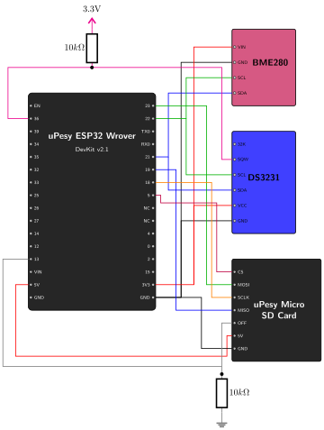

# Hardware Modifications {.unnumbered}

To implement deep sleep and power cycle our components, we need to make two additions to the Phase 01 design.

## SD Card OFF Pin (Power Cycling)

SD cards are among the most power-hungry parts of a data logger. According to the uPesy documentation, the module draws up to about **30 mA** while reading or writing (depending on the microSD card used), and around **150 µA** when idle (no SPI communication). Over months of deployment, this idle current alone would drain a large part of the battery.

To avoid it, we connect the SD card reader's **OFF** pin:

*   Pulling this pin `HIGH` (3.3V) turns the module on.
*   Pulling this pin `LOW` (0V) cuts the power to the SD card, dropping the module's consumption to approximately **1 µA**.

We connect the **OFF** pin to **ESP32 GPIO 13** and place a **10kΩ pull-down resistor** between the OFF pin and GND.

> **Why do we need a pull-down resistor? (Floating Pins)**
> When the ESP32 enters deep sleep, its standard GPIO pins stop driving their output and become "high impedance". A pin that is not connected to a defined voltage "floats": ambient electrical noise can make its voltage wander between LOW and HIGH.
>
> If the SD card's `OFF` pin floats, the module could turn itself on while the ESP32 is asleep and draw current for nothing. The 10kΩ pull-down resistor ties the `OFF` pin to 0V (LOW) whenever the ESP32 is not driving it, so the SD card stays off during sleep.

Before cutting the power, the firmware always calls `SD.end()` so that the file system is cleanly unmounted.

### Choosing the Resistor Value

Why **10kΩ**? The value is a trade-off:

*   **Too small** (e.g. 100Ω): when the ESP32 drives the pin HIGH, a current $I = 3.3V / R$ flows through the resistor to GND. With 100Ω, that is 33 mA: wasted energy, and close to the maximum current an ESP32 pin can deliver. With 10kΩ, it is only 0.33 mA, and only while the SD card is on.
*   **Too large** (e.g. 10MΩ): the resistor becomes too weak to hold the pin LOW against leakage currents and noise, and the pin behaves as if it were floating again. The exact limit is computed in the [Fallback AP](../Phase-03/03-fallback-ap.qmd#the-equations-behind-the-diagrams) chapter.

Any value between roughly 10kΩ and 100kΩ works well here. 10kΩ is a common, safe default.

## DS3231 SQW Pin (Wake-up Interrupt)

To wake the ESP32 up from deep sleep, we use the DS3231's hardware alarms. When an alarm triggers, the RTC pulls its **SQW** pin LOW.

We need to connect this SQW pin to an "RTC GPIO" on the ESP32. Only these pins can be monitored while the rest of the chip is asleep (EXT0 wake-up).

We connect the **SQW** pin to **ESP32 GPIO 36**.
Because SQW is an open-drain output, it needs a **pull-up resistor** to bring the line back HIGH (3.3V) when the alarm is inactive. GPIO 36 (like GPIOs 34 to 39) is an input-only pin **without any internal pull-up or pull-down resistor**, so the pull-up must be external: we connect a **10kΩ pull-up resistor** between the SQW pin and the 3.3V rail.

> **Note on the Pull-up Resistor Value**
> The reasoning is the same as for the pull-down. While the alarm is active, the RTC connects the `SQW` line to ground, and a current of $I = \frac{3.3V}{10\,k\Omega} = 0.33\,mA$ flows through the resistor. The alarm is cleared a few milliseconds after the ESP32 wakes up, so this has no measurable impact on the battery.

::: {.callout-note}
## Check your DS3231 module
The most common DS3231 breakout board (often called "ZS-042", sold among others by AZ-Delivery) can be recognized by its second chip, an AT24C32 EEPROM, and its coin-cell holder on the back. This board already includes pull-up resistors on SDA, SCL and SQW: adding our 10kΩ in parallel is harmless. It also includes:

- a **power LED**, which draws current permanently (around 1 mA or more, depending on its resistor): this is far more than everything else in deep sleep combined;
- a **charging circuit** for the backup cell (a resistor and a diode next to the holder), designed for a rechargeable LIR2032. Powered at 5V, it would push current into a standard, non-rechargeable CR2032, which must be avoided. Powered at 3.3V, as in this project, the voltage left after the diode stays below the voltage of a CR2032, so a CR2032 can be used safely.

Removing the LED (or its resistor) is a common modification for low-power projects. We will come back to it when the station runs on a battery.
:::

## Updated Wiring Diagram

Here is the updated circuit incorporating these two power management modifications:

{width=600}

### Wiring Summary

*   **ESP32 Pin 13** ➔ **SD Card OFF** (with a 10kΩ pull-down resistor to GND)
*   **ESP32 Pin 36 (VP)** ➔ **DS3231 SQW** (with a 10kΩ pull-up resistor to 3.3V)

## Why These Modifications Matter

The SD card power cycling and the careful choice of pull resistors only save microamps, but in deep sleep, microamps are what drains the battery. The [Power Budget](../Phase-03/05-power-budget.qmd) chapter, at the end of the PoC, quantifies each component and shows the impact of these choices.

::: {.callout-note}
## Battery operation and the 5V pin
The SD module is powered from the ESP32's **5V** pin, which is only live when the board is powered through USB. Running on a battery (Phase 12) will require revisiting how this module is powered.
:::

With the hardware ready, let's write the firmware that uses these new connections.
