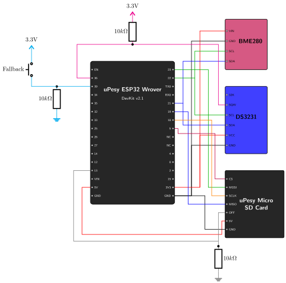
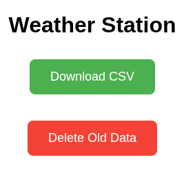

# Fallback Access Point & Web Server {.unnumbered}

If the station is deployed out of Wi-Fi range, or if you simply change your home Wi-Fi password, it can no longer upload its data. How do you then retrieve the data saved on the SD card without opening the enclosure?

We solve this with a **Fallback Access Point**. Pressing a button on the outside of the enclosure wakes the ESP32 up and makes it broadcast its own Wi-Fi network (Access Point). We can then connect to it with a phone and download the CSV file from a small web server running on the ESP32.

## The Hardware: The Fallback Button

{width=600}

To trigger this mode, we wire a push-button between **3.3V** and **Pin 39**, an RTC GPIO that can wake the ESP32 from deep sleep. Like GPIO 36, GPIO 39 is input-only and has **no internal pull resistor**, so we add an external **10kΩ pull-down resistor** between Pin 39 and GND.

### Pull-Up vs. Pull-Down Resistors
A pin that is not connected to anything is "floating": it picks up electrical noise and randomly reads `HIGH` (1) or `LOW` (0). A resistor gives the pin a defined default state when the button is not pressed:

- **Pull-up Resistor:** connects the pin to `3.3V`. The default state is `HIGH`; pressing the button connects the pin to `GND`, driving it `LOW`.
- **Pull-down Resistor:** connects the pin to `GND`. The default state is `LOW`; pressing the button connects the pin to `3.3V`, driving it `HIGH`.

::: {layout-ncol=2}


:::

In both cases, no current flows through the resistor while the button is released, since both ends are at the same voltage. The consumption during deep sleep is therefore the same.

### Which One to Choose?
Both configurations work electrically. The choice depends on three questions, in this order:

1. **What can the other side of the line do?** Many chip outputs are *open-drain*: they can only pull the line LOW, never drive it HIGH. This is the case of the I2C bus and of the DS3231 `SQW` pin. For these signals there is no choice: a **pull-up** is mandatory.
2. **What must happen when the microcontroller does not drive the pin?** During a reset, while the firmware starts, or in deep sleep, the ESP32 pins are not driven. The resistor then sets the state of the line, and this state must be the safe one. For an enable pin that switches something on (like the SD card `OFF` pin, or the gate of a transistor that powers a module), the safe state is "off": a **pull-down** keeps the module off until the firmware decides otherwise.
3. **What does the input require?** Some inputs only react to one level. On the ESP32, `EXT1` can wake the chip when *any* pin goes HIGH, but not when *any* pin goes LOW. Internal resistors also matter: most microcontrollers have internal pull-ups, but not all have internal pull-downs, and the ESP32 GPIOs 34 to 39 have neither.

When none of these constraints applies, **pull-up with active-low** is the most common convention for buttons. One reason is safety with long wires: with a pull-up, the wire going to the button carries GND, and touching a grounded metal part is harmless. With a pull-down, that wire carries 3.3V, and touching a grounded part short-circuits the supply.

Here is how these rules apply to our station:

| Signal | Resistor | Deciding rule |
|--------|----------|---------------|
| DS3231 `SQW` (GPIO 36) | Pull-up | Open-drain output (rule 1) |
| SD card `OFF` (GPIO 13) | Pull-down | Module off by default (rule 2) |
| Fallback button (GPIO 39) | Pull-down | Wake-up with `EXT1` on HIGH (rule 3) |

For the button, we accept the drawback of a 3.3V wire because the button sits on the enclosure, a few centimeters from the board.

### Why a Pull-Down and a Wake-up on HIGH?
The RTC alarm already uses the `EXT0` wake-up source, which can only monitor a single pin. The button therefore uses `EXT1`, which can monitor several pins at once. On the ESP32, `EXT1` supports two trigger modes: `ESP_EXT1_WAKEUP_ALL_LOW` (all selected pins are LOW) and `ESP_EXT1_WAKEUP_ANY_HIGH` (at least one selected pin is HIGH).

With a single button, both modes would work. But if we later add other wake-up inputs (e.g. a rain gauge), only `ANY_HIGH` wakes the ESP32 when *any* of them is triggered. We therefore choose active-high inputs: a **pull-down resistor** and `ESP_EXT1_WAKEUP_ANY_HIGH`.

### Sizing the Resistor
When the button is pressed, a current $I = 3.3V / R$ flows from 3.3V through the resistor to GND:

- **Too small:** with 100Ω, pressing the button draws 33 mA. With no resistor at all (0Ω), pressing the button would short-circuit the 3.3V rail to GND, which can damage the board's voltage regulator.
- **Too large:** with 10MΩ, the resistor is too weak to hold the pin LOW against leakage currents and noise, which can cause false wake-ups.

A **10kΩ resistor** is a common choice: it draws $0.33\,mA$ only while the button is pressed, and holds the pin firmly LOW the rest of the time.

## The Code

> **Ready-to-use project:** The complete code for this dual-boot firmware is available in the repository here: [`07_wifi_fallback_ap`](https://github.com/wg1d/personal-autonomous-weather-station/tree/main/firmware/PoC/Phase-03/07_wifi_fallback_ap)

> **Further Reading:** For a deeper dive into the specific Wi-Fi methods used below, you can refer to this excellent [uPesy tutorial on creating a Wi-Fi Access Point with an ESP32](https://www.upesy.fr/blogs/tutorials/how-create-a-wifi-acces-point-with-esp32).

When the ESP32 wakes up, we immediately check the reason. If it was woken by our Pin 39 button (`ESP_SLEEP_WAKEUP_EXT1`), we skip the sensor reading and start an Access Point named **WeatherStation_AP**:

```cpp
esp_sleep_wakeup_cause_t wakeup_reason = esp_sleep_get_wakeup_cause();

if (wakeup_reason == ESP_SLEEP_WAKEUP_EXT1) {
  Serial.println("Wakeup by Fallback Button! Starting AP Mode...");
  
  // Power on SD Card
  pinMode(SD_OFF_PIN, OUTPUT);
  digitalWrite(SD_OFF_PIN, HIGH);
  delay(500);
  SD.begin(SD_CS_PIN);

  // Start Wi-Fi Access Point
  WiFi.softAP(AP_SSID, AP_PASSWORD);
```

The Access Point credentials are defined at the top of the sketch (`AP_SSID`, `AP_PASSWORD`). The default password `12345678` is only meant for testing: change it before deploying the station (WPA2 requires at least 8 characters).

### Hosting the Web Server
We use the `ESPAsyncWebServer` library to host a small website on the ESP32.

> **Library Fork Notice:** Most older tutorials use the original `me-no-dev/ESPAsyncWebServer` library, which is no longer maintained and fails to compile on recent ESP32 cores. We use the community-maintained fork by `mathieucarbou` ([mathieucarbou/ESPAsyncWebServer](https://github.com/mathieucarbou/ESPAsyncWebServer), since moved to the [ESP32Async](https://github.com/ESP32Async/ESPAsyncWebServer) organization), which is a drop-in replacement.

We define three routes:
1. `GET /` : serves a simple HTML page with a green "Download" button and a red "Delete" button.
2. `GET /download` : downloads `weather_data.csv` from the SD card to the user's phone.
3. `POST /delete` : Deletes the CSV file from the SD card to free up space.

```cpp
server.on("/", HTTP_GET, [](AsyncWebServerRequest *request){
  request->send(200, "text/html", INDEX_HTML); // HTML page defined above
});

server.on("/download", HTTP_GET, [](AsyncWebServerRequest *request){
  request->send(SD, "/weather_data.csv", "text/csv", true);
});

server.on("/delete", HTTP_POST, [](AsyncWebServerRequest *request){
  SD.remove("/weather_data.csv");
  request->send(200, "text/html", DELETED_HTML);
});

server.begin();
```

### The 3-Minute Timeout
With the Access Point running, the ESP32 draws over 100 mA: left on, it would drain a battery within a day. In the `loop()` function, we implement a non-blocking 3-minute timer. Once it expires, we shut down the Wi-Fi radio, power off the SD card, re-arm the wake-up sources, and go back to deep sleep.

```cpp
void loop() {
  esp_sleep_wakeup_cause_t wakeup_reason = esp_sleep_get_wakeup_cause();
  if (wakeup_reason == ESP_SLEEP_WAKEUP_EXT1) {
    // AP Mode Timeout Logic (3 Minutes)
    static unsigned long apStartTime = millis();
    if (millis() - apStartTime > AP_TIMEOUT_MS) {
      Serial.println("\nAP Timeout reached. Shutting down...");
      WiFi.softAPdisconnect(true);
      WiFi.mode(WIFI_OFF);
      SD.end();
      digitalWrite(SD_OFF_PIN, LOW); // Power off SD Card

      // Re-arm wakeups (EXT0 for the RTC, EXT1 for the button) and sleep
      armWakeupSources();
      esp_deep_sleep_start();
    }
  }
}
```

### What if a sensor reading is scheduled during AP Mode?
What happens if the DS3231 alarm fires (pulling Pin 36 `LOW`) while you are downloading data through the Access Point?

While the ESP32 is awake, the `EXT0` wake-up source is not active, so the web session continues undisturbed. But as seen in Phase 02, the DS3231 alarm is **latched**: SQW stays `LOW` until the alarm flag is cleared over I2C.

When the 3-minute session ends and the ESP32 enters deep sleep, Pin 36 is already `LOW`, so the ESP32 wakes up immediately through `EXT0`. It then runs the normal path: it clears the alarm, takes the missed reading (with a timestamp slightly off the grid), uploads, and schedules the next alarm back on the grid. No extra code is needed to handle this case.

> **Why don't we reprogram the alarm before sleeping?**
> In the AP path, we do *not* touch the RTC before going back to sleep. The DS3231 keeps the alarm that was set during the last normal wake-up: if it has not fired yet, the next reading happens on schedule; if it has, the latched SQW line wakes the ESP32 up immediately, as described above.

## Running the Test
1. Compile and upload `07_wifi_fallback_ap` to your ESP32.
2. The ESP32 will go to sleep. **Do not wait for the RTC timer.** Instead, simply **press the physical button** you just wired to Pin 39.
3. Open your smartphone's Wi-Fi settings and connect to `WeatherStation_AP` (Password: `12345678`).
4. Open your web browser and navigate to `http://192.168.4.1` (the default ESP32 AP IP address).
5. You should see the web page. Click **Download** to get the data, or **Delete** to remove the file from the SD card.
6. Wait 3 minutes, and watch the Serial Monitor as the ESP32 automatically shuts down the AP and returns to Deep Sleep.

### Expected Output

If everything is wired correctly, the Serial Monitor shows the following sequence: a standard reading, a fallback AP session, and a "catch-up" reading that realigns on the 30-second grid.

```text
--- Waking up from Deep Sleep ---
Standard Wakeup (RTC Alarm). Taking reading...
Data: 2026-07-24T15:58:30;30.15;31.03;991.36
Data saved to SD card.
Connecting to WiFi.....
Connected to WiFi network
Uploading CSV file to server: http://192.168.1.15:5000/upload
HTTP Response code: 200
Next reading scheduled for: 15:59:00
Entering Deep Sleep...
ets Jun  8 2016 00:22:57

... [User presses the button] ...

--- Waking up from Deep Sleep ---
Wakeup by Fallback Button! Starting AP Mode...
AP IP address: 192.168.4.1
Web server started.
AP Mode shutting down in 170 seconds...
User is downloading weather_data.csv...
AP Mode shutting down in 160 seconds...
User deleted weather_data.csv!
AP Mode shutting down in 150 seconds...
...
AP Timeout reached. Shutting down...
Entering Deep Sleep...
ets Jun  8 2016 00:22:57

... [ESP32 wakes up immediately: the RTC alarm fired during AP Mode] ...

--- Waking up from Deep Sleep ---
Standard Wakeup (RTC Alarm). Taking reading...
Data: 2026-07-24T16:01:53;30.56;30.51;991.27
Data saved to SD card.
Connecting to WiFi....
Connected to WiFi network
Uploading CSV file to server: http://192.168.1.15:5000/upload
HTTP Response code: 200
Next reading scheduled for: 16:02:00
Entering Deep Sleep...
```

And here is what the web interface looks like on a phone:

{width=200}

## Next Steps
The station now has automatic uploads and a manual fallback. Since it already connects to Wi-Fi to upload data, it can also correct its clock. The **Bonus Step: NTP Time Synchronization** uses this connection to keep the DS3231 on time automatically.
